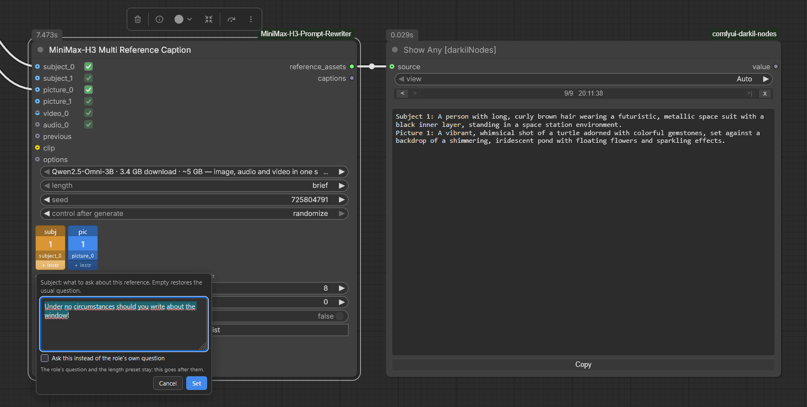

# MiniMax-H3 Prompt Rewriter for ComfyUI

面向 [LightX2V MiniMax-H3 T2VA Prompt Rewriter LoRA](https://huggingface.co/lightx2v/MiniMax-H3-Prompt-Rewriter-LoRA) 的
ComfyUI 节点。输入一句简短的提示词，输出一段结构化、可直接投入生产的音视频描述，
供 [MiniMax-H3](https://huggingface.co/MiniMaxAI/MiniMax-H3) 使用 —— 全程在本地完成。

[English version](README.md) · [Русская версия](README_RU.md) · [更新日志](CHANGELOG.md)

> **本文档为机器翻译。** 本项目作者不懂中文，这份中文 README 是由 AI 从英文版翻译过来的。
> 术语和措辞难免有不准确的地方；如果发现错误、意思偏了或者读不通顺的段落，欢迎到
> [issue](https://github.com/pytraveler/MiniMax-H3-Prompt-Rewriter-ComfyUI/issues)
> 里指出来，我会改。两边说法有出入时，以[英文版](README.md)为准。

<p align="center">
  <a href="https://github.com/pytraveler/MiniMax-H3-Prompt-Rewriter-ComfyUI/releases/latest"></a>
  <a href="LICENSE"></a>
  
  <a href="https://registry.comfy.org/publishers/darkil/nodes/minimax-h3-prompt-rewriter"></a>
  <a href="https://huggingface.co/lightx2v/MiniMax-H3-Prompt-Rewriter-LoRA"></a>
  <a href="https://huggingface.co/pytraveler/MiniMax-H3-Prompt-Rewriter-LoRA-GGUF"></a>
  <a href="https://huggingface.co/pytraveler/MiniMax-H3-Prompt-Rewriter-LoRA-8B-GGUF"></a>
  <a href="https://huggingface.co/pytraveler/MiniMax-H3-Prompt-Rewriter-LoRA-Omni-GGUF"></a>
  <a href="https://www.youtube.com/watch?v=h3rZTIRB_G8"></a>
  <a href="https://www.youtube.com/watch?v=PZd9fWX15VA"></a>
</p>


提示词可以用底座模型读得懂的任何语言写；重写的结果一律返回英文 —— MiniMax-H3
要的正是英文。

```text
"A red fox walks through a snowy forest at dawn."  +  16:9  +  15s
                              │
                              ▼
              Qwen3.6-27B + Prompt Rewriter LoRA
                              │
                              ▼
   integrated_multimodal_description: [Shot 1] ... [Shot 2] 0:06 ...
   overall_soundscape: ...
   non_diegetic_music: ...
                              │
                              ▼
              MiniMax-H3: 视频 + 同步音频
```

拿到这样的输出有四条路，这个节点包四条都给了：

| | 重写器节点 | 重写器 8B | 重写器 Omni | 写作节点 |
|---|---|---|---|---|
| 格式从哪儿来 | LoRA —— 一个 27B 模型，一直训练到不用任何提示也会自己吐出 H3 格式 | 第二个 LoRA，底座模型还能看 | 第三个 LoRA，底座模型还能听 | MiniMax 官方的写作指南，写在系统提示词里 |
| 模型 | 只能是 Qwen3.6-27B | 只能是 Qwen3-VL-8B-Instruct | 只能是 Qwen2.5-Omni-7B | 任何能跟随指令的 GGUF |
| 最小可用配置 | 约 10 GB 下载，约 13 GB 显存 | 约 6.1 GB 下载，约 9 GB 显存 | 约 6.2 GB 下载，约 9 GB 显存 | **2.6 GB 下载，约 5 GB 显存** |
| 任务 | T2VA | T2VA、I2VA、FL2VA、L2VA | T2VA、I2VA、FL2VA、L2VA、**Ref2VA** | T2VA、I2VA、FL2VA、L2VA、Ref2VA |
| 参考帧 | 得用文字描述给它听 | **它自己看** | **它自己看** | 得用文字描述给它听 |
| 片段和声音 | 得用文字描述给它听 | 得用文字描述给它听 | **它自己看、自己听** | 得用文字描述给它听 |
| 质量 | 基准 | 同一套训练出来的格式，下载量只有三分之一；对齐行写得没那么稳 | 唯一听得见的一个；Ref2VA 下有六个字段 | 很接近，而且能跑在 LoRA 根本带不动的硬件上 |

前三列也可以合成一个节点 —— [Universal Rewriter](#minimax-h3-universal-rewriter-通用重写器) ——
换一个标签页就换掉适配器，其他东西都留在原地。

四个里面有两个只读文字。[Reference Caption](#minimax-h3-reference-caption-参考素材描述)
把图像、音频或者视频变成它们需要的文字 —— 在一个 3.4 GB 的模型上，每份素材 3 到 5 秒。
当一整场镜头的参考素材都排着队时，[Multi Reference Caption](#minimax-h3-multi-reference-caption-多参考素材描述)
一次全部处理 —— 或者交给 [Universal Writer](#minimax-h3-universal-writer-通用写作节点)：
在同一个节点里既描述素材又写出提示词，而且素材的顺序是一个可以拖动的小部件，
而不是“你当时恰好插在了哪个槽上”的结果。8B 重写器对参考*帧*完全不需要这一套：
把图接上去，它自己读。Omni 重写器则整套都不需要 —— 一段片段、一段声音，可以原样送到它面前。

还有一种情况：通往好提示词的最短路径，是别人已经写好的那一条。
[Prompt Presets](#minimax-h3-prompt-presets-提示词预设) 会从节点包内置的一千条
成品 MiniMax-H3 提示词里递给你一条，可以按画面风格和主题筛选，每一条都配着当初
为它写的那段视频的画面，而那段视频也只有一次点击的距离。它不加载任何模型，
也不下载任何东西。

如果你的显卡只有 8 GB，直接跳到[写作节点](#minimax-h3-prompt-writer-t2vai2vafl2val2va-提示词写作节点)。

## 目录

- [安装前需要准备什么](#安装前需要准备什么)
- [安装](#安装)
  - [示例工作流](#示例工作流)
- [节点](#节点)
  - [MiniMax-H3 Prompt Rewriter 提示词重写器](#minimax-h3-prompt-rewriter-提示词重写器)
  - [MiniMax-H3 Prompt Rewriter 8B 看得见画面](#minimax-h3-prompt-rewriter-8b-看得见画面)
  - [MiniMax-H3 Prompt Rewriter Omni 看得见也听得见](#minimax-h3-prompt-rewriter-omni-看得见也听得见)
  - [MiniMax-H3 Universal Rewriter 通用重写器](#minimax-h3-universal-rewriter-通用重写器)
  - [MiniMax-H3 Rewriter Options 重写器选项](#minimax-h3-rewriter-options-重写器选项)
  - [MiniMax-H3 Prompt Writer (T2VA/I2VA/FL2VA/L2VA) 提示词写作节点](#minimax-h3-prompt-writer-t2vai2vafl2val2va-提示词写作节点)
  - [MiniMax-H3 Prompt Writer (Ref2VA) 提示词写作节点](#minimax-h3-prompt-writer-ref2va-提示词写作节点)
  - [MiniMax-H3 Universal Writer 通用写作节点](#minimax-h3-universal-writer-通用写作节点)
  - [MiniMax-H3 Reference Caption 参考素材描述](#minimax-h3-reference-caption-参考素材描述)
  - [MiniMax-H3 Multi Reference Caption 多参考素材描述](#minimax-h3-multi-reference-caption-多参考素材描述)
  - [用 ComfyUI 已经加载好的模型来生成描述](#用-comfyui-已经加载好的模型来生成描述)
  - [描述模型只加载一次，不是每份素材加载一次](#描述模型只加载一次不是每份素材加载一次)
  - [MiniMax-H3 Guide Prompt (any LLM) 指南提示词](#minimax-h3-guide-prompt-any-llm-指南提示词)
  - [MiniMax-H3 Prompt Check 提示词检查](#minimax-h3-prompt-check-提示词检查)
  - [MiniMax-H3 Prompt Reducer 提示词精简器](#minimax-h3-prompt-reducer-提示词精简器)
  - [MiniMax-H3 Reduce Prompt (any LLM) 精简提示词](#minimax-h3-reduce-prompt-any-llm-精简提示词)
  - [MiniMax-H3 Effect Embeddings 特效嵌入](#minimax-h3-effect-embeddings-特效嵌入)
  - [MiniMax-H3 LoRA Triggers LoRA 触发词](#minimax-h3-lora-triggers-lora-触发词)
  - [MiniMax-H3 Reference Adapter 参考素材适配器](#minimax-h3-reference-adapter-参考素材适配器)
  - [MiniMax-H3 Prompt Presets 提示词预设](#minimax-h3-prompt-presets-提示词预设)
  - [时长小部件](#时长小部件)
  - [重复上一次的答案](#重复上一次的答案)
  - [答案会被检查一遍](#答案会被检查一遍)
  - [照着发现的问题动手](#照着发现的问题动手)
  - [提示词库](#提示词库)
  - [写作指南是取下来的，不是随包附带的](#写作指南是取下来的不是随包附带的)
  - [模型列表](#模型列表)
  - [你为 Ollama 拉下来的那些模型](#你为-ollama-拉下来的那些模型)
- [权重都落在哪儿](#权重都落在哪儿)
- [用你已经有的模型](#用你已经有的模型)
  - [更小的重打包](#更小的重打包)
  - [如果节点说缺了某个包](#如果节点说缺了某个包)
- [什么都不用另装的最小下载量](#什么都不用另装的最小下载量)
- [GGUF —— 还要更小，而且什么都不用装](#gguf--还要更小而且什么都不用装)
  - [节点上的进度](#节点上的进度)
  - [环境变量](#环境变量)
  - [语言](#语言)
- [杂记](#杂记)
- [致谢](#致谢)
- [许可证](#许可证)

## 安装前需要准备什么

走 LoRA 这条路，面对的是一个 270 亿参数的语言模型，不是什么小助手。下面这些
要求绕不过去，因为适配器只和一个特定的底座模型绑定。**写作节点没有这些要求** ——
见下面它们自己的表格。

| 资源 | 要求 |
|---|---|
| 磁盘 | `Qwen/Qwen3.6-27B` 需要 **约 52 GB**，适配器另需 **约 3.5 GB** —— 走 GGUF 路线的话总共 **约 10–16 GB** |
| 显存（`nf4`，默认） | **约 16 GB** |
| 显存（`int8`） | 约 28 GB |
| 显存（`bfloat16`） | 约 54 GB，会通过 accelerate 溢出到系统内存 |
| 显存（GGUF） | 约 13–19 GB，取决于量化等级；卸载到 GPU 上的层数少一些，占用还能更低 |
| 软件包 | `transformers`、`peft`、`accelerate`，`nf4`/`int8` 还需要 `bitsandbytes`。**走 GGUF 路线什么都不用装：** 系统里恰好有 `llama-cpp-python` 就用它，没有就去取 llama.cpp 官方的二进制文件 |

> **MiniMax-H3 的文本编码器不能拿来干这件事。** 它和 LoRA 的底座是两个不同的模型
> （Qwen3-VL-32B，词表 151936；底座是 Qwen3.6-27B，词表 248320）；它里面没有适配器
> 要挂上去的那些线性注意力 `in_proj_*` 模块；它被截断到 64 层里的前 50 层；而且它
> 不带 `lm_head`，也没有最后的归一化层，所以它根本没法生成文本。它只为 DiT 产出
> 隐藏状态。

## 安装

克隆到 `ComfyUI/custom_nodes/`，再把依赖装进 ComfyUI 实际运行的那个 Python 环境：

```bash
cd ComfyUI/custom_nodes
git clone https://github.com/pytraveler/MiniMax-H3-Prompt-Rewriter-ComfyUI
```

Windows 上的 ComfyUI 便携版：

```bat
python_embeded\python.exe -m pip install -r ComfyUI\custom_nodes\MiniMax-H3-Prompt-Rewriter-ComfyUI\requirements.txt
```

或者用 ComfyUI-Manager 从 Comfy registry 安装。

### 示例工作流

节点包自带七个工作流。装好之后，它们会出现在 ComfyUI 的模板浏览器里
（*Workflow → Browse Templates*），归在本节点包的名字下面。每一个都是独立的一张
卡片，也都能独立跑起来：打开时没有任何节点被绕过，也不必先静音另一条分支才能
按下运行。

| | 模板 | 需要什么 |
|---|---|---|
| 1 | **Write a prompt** —— 输入一句想法，输出一段完整的 H3 音视频描述 | 一个 2.6 GB 的 GGUF |
| 2 | **Rewrite a prompt with the 27B LoRA** —— 本节点包名字的由来，LightX2V 的那个适配器 | 一个 15.7 GB 的 GGUF |
| 3 | **Write a prompt from references** —— 写作节点先描述你的图片，再照着看到的内容写 | 两个 GGUF，合计 6 GB |
| 4 | **Ready-made prompts** —— 一千条现成的提示词，在浏览器里连着画面一起挑 | 什么都不需要 |
| 5 | **Prompt to video** —— ComfyUI 自带的文生视频模板，前面接上写作节点 | MiniMax-H3 的权重 |
| 6 | **References to video** —— 同样的东西，换成 Ref2VA，图片同时送到写作节点和生成器 | MiniMax-H3 的 ref2va 权重 |
| 7 | **LoRA triggers and effects** —— 适配器要听的那些词，和 MiniMax 的十个特效，放进一段写好的提示词里 | 什么都不需要 |

会加载 MiniMax-H3 检查点的只有 5 和 6。其余的到文本为止就结束了，而这正是本节点包
大部分内容存在的意义。那两个是 ComfyUI 自己图库里的模板，把生成那一半折进了一个
子图方框，所以屏幕上剩下的就是提示词这一侧再加一个节点 —— 它们点名的检查点就是
官方模板用的那些，缺了哪个 ComfyUI 会主动提出替你下载。

每一个都带着一张 **Read me first** 说明：它做什么、会下载什么、按下运行之前要设置
什么、接下来该往哪儿走。3 和 6 里面的图像加载器**故意是空的** —— 存进模板里的文件名
指向的是你机器上没有的东西 —— 所以先挑你自己的图片。

浏览器在每个名字旁边画的那张卡片图来自 `python tools/template_cards.py`：它把图片
写成 `<name>.jpg`，放在工作流旁边，也就是浏览器会去找的地方。

社区那边也有一份：[axiomgraph 的工作流](https://github.com/axiomgraph/ComfyUIWorkflow)
把 Omni 重写器和 FL2VA 搭在一起（GPL-3.0 协议，另外还用了几个别的节点包 ——
去他们的仓库里拿）。

## 节点

### MiniMax-H3 Prompt Rewriter 提示词重写器

主力节点。缺什么就下载什么，加载模型，生成，然后把显存再还回去。

**输出**

| 名称 | 内容 |
|---|---|
| `rewritten_prompt` | 完整的重写结果，可以直接粘进 MiniMax-H3 的文本输入 |
| `integrated_multimodal_description` | 只有逐镜头的画面部分 |
| `overall_soundscape` | 只有画内声音的部分 |
| `non_diegetic_music` | 只有配乐的部分 |

**输入**

- `prompt` —— 要展开的那句短提示词。
- `model` —— 底座模型。列表里既有你模型列表中的每一项，也有硬盘上已经存在的每一个
  Qwen3.6-27B（前缀是 `on disk:`）。不在本地的会在第一次使用时下载，中断了可以续传。
  **Model list** 按钮会在画布上方开一个窗口来编辑这份列表 —— 见后文。
- `resolution` / `duration` —— 重写要照着哪些条件来写。把它们和你交给 MiniMax-H3 的
  设置保持一致，否则镜头节奏对不上。列表从 `48:9` 一直排到 `9:16`；两个超宽比例是
  多显示器的情形 —— 32:9 是两块 16:9 屏幕并排，48:9 是三块。它们决定的是镜头怎么构图，
  而这也正是本节点唯一决定的事；生成器在那个形状下会渲染出什么，是另一回事。
- `aspect_ratio` —— **同一个设置，只是挂在插槽上**，而且只要有东西连着它就说了算。
  节点包里每一个写作节点和重写节点都有它，它接受 `STRING` 或 `COMBO` 连线，所以那个
  已经在给 ComfyUI 的 **Resolution Selector** 设值的 Primitive 节点，可以用同一根线
  顺带驱动它。它存在的理由是：画面形状通常是在图里别的地方定下来的，而那边的写法
  各不相同 —— ComfyUI 自己的 **Resolution Selector** 把 16:9 叫作 `16:9 (Widescreen)`，
  尺寸节点说的是 `3840x1080`，除法节点说的是 `1.78`。这三种都能读，标签把数字对包在
  里面也能读穿 —— 真正算数的是那一对数字。画面尺寸只要和列表里某个比例相差不超过
  2%，就按那个比例的名字算，所以 `1376x768`（Resolution Selector 在 1 MP 下为 16:9
  给出的正是这个尺寸）到这里是 `16:9`，而不是 `43:24`；列表里完全没有的比例则按原样
  通过，`2.39:1` 或者 `5:4` 就是这么进来的。至于根本不是比例的东西，会被点名拒绝，
  而不是拿去照着构图。`resolution` 小部件本身没有插槽，所以入口只有一个，而这个入口
  读的正是别的节点写出来的东西。**连线接上时，选择器会变灰** —— 暗掉，没有任何一项
  亮着，点击也不响应 —— 因为亮着的那一格会指向一个这次运行根本不会用的比例。
  **拔掉连线会清空这个字段**：上游节点是把自己的值写进小部件里的 —— 连线喂给小部件
  输入本来就是这么工作的 —— 否则那段文字会留在原地，而它待在那儿并不是不起作用的。
  `aspect_ratio` 里的任何东西都压过选择器，残留值也算。
- `quantization` —— 怎么加载一个*未量化*的检查点：`nf4`（默认，约 16 GB 显存）、
  `int8`（约 28 GB）、`bfloat16` / `float16`（约 54 GB）。检查点自带量化时，这一项被忽略。
- `greedy` —— 默认开启，输出是确定性的。想采样就把它关掉。
- `seed`
- `keep_model_loaded` —— **默认关闭。** 重写一结束，27B 模型就被释放，好让同一块 GPU
  接着去跑 H3 视频生成。只有在连着不停地打磨提示词时才打开它。
- `options` —— 可选；接一个 **MiniMax-H3 Rewriter Options** 节点。

### MiniMax-H3 Prompt Rewriter 8B 看得见画面

同样的思路，换到一个小得多、而且是多模态的模型上。LightX2V 的第二个适配器训练在
[Qwen3-VL-8B-Instruct](https://huggingface.co/Qwen/Qwen3-VL-8B-Instruct) 上，所以
27B 必须*被人告诉*参考帧里有什么，而这一个是直接看到那张画面，照着看到的内容写出
对齐行（开头那句告诉 H3 参考帧落在什么位置的固定语句）。它覆盖四个任务而不是一个，
而且装得进 27B 根本靠近不了的显卡。

![ComfyUI 中的 8B 重写器节点，任务设为 T2VA：左边是选项节点，中间是带 first_frame 和 last_frame 输入的重写器，右边是写好的结果，里面有编号的镜头、(S1) 和 (S2) 说话人标识，以及一条 <d>[English] Hello.</d> 对白标签](docs/node_rewriter_8b.png)

**输出**和上面那个重写器完全一样的四个，所以两者在下游可以互换。

**输入**

- `prompt`、`resolution`、`duration`、`greedy`、`seed` —— 同上。
- `model` —— 一个 Qwen3-VL-8B 底座，适配器发布成什么形状，这里就支持什么形状。
  **GGUF** 条目是同一次转换产出的两个文件：模型本体和它的投影器。**safetensors**
  条目是官方的
  [Qwen3-VL-8B-Instruct](https://huggingface.co/Qwen/Qwen3-VL-8B-Instruct)
  文件夹，适配器就是在它上面训练、也是按它发布的。带 `on disk:` 前缀的条目已经在
  你的模型目录里了。**只有 8B 才配得上这个适配器**；别的尺寸的 Qwen3-VL 会在下载
  任何东西之前，就按名字和数字被拒掉。
- `quantization` —— 怎么加载一个 **safetensors** 底座：`nf4` 需要大约 8 GB 显存，
  `int8` 大约 13 GB，`bfloat16` 大约 20 GB。GGUF 自带量化，这一项对它无效。
- `task` —— `T2VA`、`I2VA`、`FL2VA`、`L2VA`。模型自己给这几个任务起的名字是 T2AV、
  I2AV、FL2AV 和 L2AV；指的是同样这四个任务。
- `first_frame` / `last_frame` —— 可选的 IMAGE 输入。`I2VA` 读 `first_frame`，
  `L2VA` 读 `last_frame`，`FL2VA` 两个都读，`T2VA` 一个都不读。接错了的话，节点会在
  加载任何东西之前就说出缺的是哪一个 —— 一张图属于片段的哪一头，本身就是要告诉
  模型的信息之一。
- `keep_model_loaded` —— 在 **safetensors** 底座上，四个任务都认这个开关：模型加载在
  ComfyUI 自己的进程里，就留在那儿。在 **GGUF** 底座上，只有 `T2VA` 能做到，因为带
  画面的那三个任务是走 `llama-mtmd-cli` 的，每次都是一个新进程，退出时把模型一起带走。
  节点会说明它实际做了哪一种，而不是默默忽略这个开关。
- `options` —— 和其他节点用的是同一个选项节点。它的 `adapter` 下拉框里两个 LoRA 都在；
  第一项会自动挑中与你所选底座相匹配的那一个，所以不用管它。

**它的开销**

| | 下载 | 显存 |
|---|---|---|
| Q4_K_M 底座 + 投影器 + Q8_0 适配器 | 4.7 + 0.7 + 0.7 GB | 约 9 GB |
| Q8_0 底座 + 投影器 + F16 适配器 | 8.1 + 0.7 + 1.3 GB | 约 13 GB |
| safetensors 底座 + 适配器，`nf4` | 17.5 + 2.8 GB | 约 8 GB |
| safetensors 底座 + 适配器，`bfloat16` | 17.5 + 2.8 GB | 约 20 GB |

GGUF 那两行还要额外付一次运行时的钱，每台机器一次：`I2VA`、`FL2VA` 和 `L2VA` 走的是
`llama-mtmd-cli`，所以其中第一个跑起来时会去取 llama.cpp 的官方构建 —— 34 MB，如果
`llama_backend` 解析到 CUDA 则是 511 MB —— 而且已经装好的 `llama-cpp-python` 顶不了
这个位置。`T2VA` 是唯一一个可以改用 wheel 的任务。

GGUF 路线的下载量小得多，而且什么都不用装。safetensors 路线是适配器发布时的原始形状，
四个任务都能让模型常驻显存而不只是 `T2VA`，如果你本来就有这个检查点，那就该选它 ——
但它需要 `transformers` 和 `peft`，这两个包节点包已经列进依赖里了。

**该对它抱什么期待。** 四个任务产出的都是训练好的那个形状：`T2VA` 上来就直接写三个
字段，另外三个则以 MiniMax-H3 自己会读的那句对齐语句开头。适配器带来的可见差别是
镜头标记 —— 把 `use_lora` 关掉，同一个模型照样会把三个字段填满，因为格式约定写在
系统提示词里，但它不再写 `[Shot 2]` 这样的切分标记，而且答案的长度大约只剩三分之一。

它终究是个 8B，这一点在一个地方露了馅：对齐行里的时间戳有时会写成三位小数而不是
两位，而在 `FL2VA` 上，最后那张图偶尔会被记到 `Shot 1` 头上，而不是最后一个镜头。
27B 不会这样。下游没有任何东西会去解析那一行，所以它不会让任何地方出错 —— 但粘贴
之前值得扫一眼。

### MiniMax-H3 Prompt Rewriter Omni 看得见也听得见

LightX2V 的第三个适配器，也是第一个会听的。它训练在
[Qwen2.5-Omni-7B](https://huggingface.co/Qwen/Qwen2.5-Omni-7B) 上 —— 正是本节点包
的描述节点已经在用的那个模型 —— 所以参考素材是以它本来的样子送到它面前的：图片、
片段，或者声音。它也是三个里面唯一覆盖 **Ref2AV** 这个全参考任务的，而这个任务回答
的是六个字段而不是三个。


**输出。** 一共七个，哪些会被填满取决于任务。四个带画面的任务返回的是和另外两个
重写器一样的那三个字段，所以下游可以互换。`Ref2AV` 返回六个：`subject_definitions`、
`summary`、`retention_analysis`、`detailed_description`、`overall_soundscape` 和
`non_diegetic_music` —— 和 [Ref2VA 写作节点](#minimax-h3-prompt-writer-ref2va-提示词写作节点)
产出的是同一组，含义也相同。`rewritten_prompt` 永远装着完整的答案。

**输入**

- `prompt`、`resolution`、`greedy`、`seed` —— 同上。
- `references` —— 一个会自动增长的插槽，接受 IMAGE、VIDEO 或者 AUDIO。这里不存在
  “插错插槽”：一份参考素材叫什么，是由它本身是什么决定的。图片在图片之间编号，声音
  在声音之间编号，所以在两张图片中间接进一段声音，不会把它们重新编号。
- `task` —— `T2AV`、`I2AV`、`L2AV`、`FL2AV`、`REF2AV`。只有 `REF2AV` 收片段和声音；
  另外四个只照着图片来写，往它们身上接一段声音会在加载任何东西之前就被点名拒绝。
- `duration` —— **节点会把它吸附到网格上。** MiniMax-H3 是在 24 fps 下按 17n+5 的
  帧数网格生成的，所以大多数长度根本不存在：你要 10 秒，实际是 243 帧、10.13 秒，
  而写进这一轮请求、并在对齐行里被引用的正是*后面这个*数字。小部件写的是你的本意；
  对齐行和视频能对上，靠的就是这次吸附。
- `model` —— 一个 Qwen2.5-Omni-7B 底座，可以是 **GGUF** 组合（模型本体加它的投影器），
  也可以是官方的 **safetensors** 文件夹。带 `on disk:` 前缀的条目已经在你的模型目录里。
  有两类“差一点就对”的情况是被标出来而不是被藏起来的：Qwen2.5-Omni-**3B** 会标成
  `(wrong size for the adapter)`；而 **Qwen2.5-VL-7B** —— 它的架构字符串一样、同样是
  28 个块、宽度也一样，所以适配器*确实*挂得上去 —— 会标成
  `(vision only, not an Omni build)`，因为它的投影器里没有音频编码器，写出来的重写
  会去描述一段从来没被听见过的声音。**Open model list** 按钮编辑的是 `models_omni`
  这一节 —— 见后文。
- `quantization` —— 怎么加载一个 **safetensors** 底座：`nf4` 约 9 GB 显存，`int8`
  约 12 GB，`bfloat16` 约 20 GB。对 GGUF 无效。**挑你的显卡装得下的最大那个** ——
  见后文。
- `max_frames` —— 从一段片段里取多少帧，均匀分布。对模型来说，每一帧都是一张独立的图片。
- `reference_layout` —— 素材条的状态，以 JSON 保存。做成小部件是为了让这套排布能跟着
  工作流走，也能穿过 API；界面上则把它画成一排方块。
- `keep_model_loaded` —— 在 **safetensors** 底座上有效。在 **GGUF** 底座上，带参考
  素材的任务走的是 `llama-mtmd-cli`，那是一个新进程，退出时会把模型一起带走，节点
  会把这一点说出来，而不是默默忽略这个开关。
- `options` —— 和其他节点用的是同一个选项节点。

**素材条就是顺序本身。** 每一份连上来的参考素材都会显示成一个彩色方块 —— 图片是蓝色，
片段是绿色，声音是紫色 —— 上面写着它将被叫作什么、来自哪个插槽。拖动就能重新排序，
而这个顺序决定了标签的编号：把第二张图片拖到最前面，它就成了 `<Picture 1>`。点一下
方块可以在不拔线的情况下把它关掉。任务条会把当前这批参考素材伺候不了的任务置灰，
鼠标悬停时说明原因，所以只有一张图片时的 `FL2AV` 是明摆着不可用，而不是两分钟之后
才失败。

这里**故意没有重新贴标签这回事**，和 Universal Writer 的素材条不一样。在那边，一张
图片可以被指定去代表一个主体或者一段片段，因为那种由写作指南驱动的请求是手工点名
自己的参考素材的。而在这里，插槽就把事情定死了 —— 而且*主体*在这个适配器这儿是它
**产出**的东西，写在 `subject_definitions` 里，不是请求提供给它的东西。

**它的开销**

| | 下载 | 显存 |
|---|---|---|
| Q4_K_M 底座 + 投影器 + Q8_0 适配器 | 4.4 + 1.4 + 0.34 GB | 约 9 GB |
| Q8_0 底座 + 投影器 + F16 适配器 | 8.1 + 1.4 + 0.65 GB | 约 13 GB |
| safetensors 底座 + 适配器，`nf4` | 22.4 + 1.3 GB | 约 9 GB |
| safetensors 底座 + 适配器，`bfloat16` | 22.4 + 1.3 GB | 约 20 GB |

GGUF 底座还要为 llama.cpp 运行时付一次钱：除了 `T2VA`，每个任务都带参考素材，因而
都走 `llama-mtmd-cli` —— 34 MB，如果 `llama_backend` 解析到 CUDA 则是 511 MB，而且
装没装 `llama-cpp-python` 对这件事毫无影响。

GGUF 适配器是用 llama.cpp 的 `convert_lora_to_gguf.py` 从 LightX2V 自己的 safetensors
转出来的，发布在
[pytraveler/MiniMax-H3-Prompt-Rewriter-LoRA-Omni-GGUF](https://huggingface.co/pytraveler/MiniMax-H3-Prompt-Rewriter-LoRA-Omni-GGUF)。
`Q8_0` 版本只有 `F16` 的一半大，表现完全一样。

**量化买来的是显存，不是速度。** 这和直觉正好相反 —— 更小的模型应该搬运更少的字节、
跑得更快才对。在这个适配器上、同一块显卡、同样的提示词、同样两张图片、同样 256 个
token 的实测结果：

| | 显存 | 生成速度 |
|---|---|---|
| `bfloat16` | 19.4 GB | **18.6 tok/s** |
| `nf4` | 8.6 GB | 15.1 tok/s |
| `int8` | 12.0 GB | 6.0 tok/s |

`int8` 在两项上都是三个里面最差的：比 `nf4` 慢，*而且*比它还大。这不是这个适配器
的怪癖 —— bitsandbytes 的 `load_in_8bit` 就是 LLM.int8()，它把每一次矩阵乘法拆成
一个 fp16 的离群值部分和一个 int8 部分再合并起来，每次都要给激活值做类型转换。它是
一套用来“把本来装不下的模型装进去”的方案，代价就是这么多。`nf4` 是更好的那个小选项，
但它同样在每次矩阵乘法时反量化，所以它也赢不了 `bfloat16`。因此只量化到显卡真正
装得下的那一档就行：有 24 GB 或更多的话，`bfloat16` 既最快也最忠实。

这条结论对本节点包里任何一个 safetensors 底座都成立，因为这个机制是 bitsandbytes
的，不是模型的。**而它对 GGUF 路线完全不适用**，那边 llama.cpp 有真正的量化算子：
同一个 FL2AV，走 `bfloat16` safetensors 要 26 秒，走 `Q4_K_M` 只要 10 秒。

**图片在模型看到之前会先被缩放。** LightX2V 自己的推理脚本把一张图片的上限定在
301056 像素 —— 也就是 384 个 token —— 片段里的一帧则是 100352，本节点照做。这不只是
省一点：一张 1616×1616 的图片是 3249 个 token，两张就能在提示词还没数进去一个字的
时候撑爆 8k 上下文，而且这等于是拿一个它训练时从没见过的形状去喂模型。上下文随后
会按这一轮请求的实际开销来定大小，所以带八份参考素材的 `Ref2AV` 是把上下文撑宽，
而不是直接失败。

**safetensors 路线只能看图。** ComfyUI 进程内的 Transformers 路径没有办法把一段声音
递给模型，所以在那种底座上接一段片段或者声音会被拒绝，而不是从请求里悄悄丢掉。
想用它们，就挑一个 GGUF 底座。

### MiniMax-H3 Universal Rewriter 通用重写器

三个提示词重写 LoRA 装在一个节点里，顶上的标签页决定跑哪一个。
[Prompt Rewriter](#minimax-h3-prompt-rewriter-提示词重写器)、
[Prompt Rewriter 8B](#minimax-h3-prompt-rewriter-8b-看得见画面) 和
[Prompt Rewriter Omni](#minimax-h3-prompt-rewriter-omni-看得见也听得见)
原封不动，也仍然都在 —— 你已经搭好的东西不会因此停摆。

这三个适配器不是同一个东西的三档设置。27B 是纯文本的：Qwen3.6-27B，一个任务，参考帧
只能以别人写下的一句话的形式抵达它。8B 是多模态的：Qwen3-VL-8B，四个任务，收的是
图片本身。Omni 是多模态而且还会听：Qwen2.5-Omni-7B，同样那四个任务，外加它自己独有
的第五个。底座不同、尺寸不同、下载量也不同。

正因为如此，手工在它们之间来回切换才格外磨人。提示词还是那句提示词，画面比例还是
那个画面比例，时长还是那个时长 —— 于是“换个适配器试试”就意味着把这一切重新敲进
第二个节点，然后还得让两边一直保持同步。

![处在 Omni 标签页、正在跑 Ref2VA 的通用重写器：左边一列四行参考素材 —— first_frame、last_frame、reference_video 和 reference_audio，每一行都接好并且打开着 —— 右边八个输出，先是每个任务都会填的那三个，后面跟着 Ref2VA 追加的四个。顶上横排三个标签页，亮着的是 “Omni LoRA / sees, hears”；任务条上 Ref2VA 亮着；八个按真实比例画出的画面比例方框，从 48:9 到 9:16，选中的是 16:9；时长滑块停在 10；提示词是 “A blue whale breaching at sunset, filmed from a drone”；下面 model_omni 指向硬盘上的一个 Qwen2.5-Omni-7B Q8_0，quantization_omni 设为 bfloat16；再往下是 aspect_ratio、repeat_last 和三个按钮：Open model list、Save the last prompt 和 Prompt library。右边是六个字段的答案，在保留度分析里每一份参考素材都标着 fully_preserved](docs/node_universal_rewriter.png)

*一个节点，三个标签页。模型那几行以上的东西不属于任何标签页 —— 任务、比例、时长和
提示词是同一组值，无论哪个适配器亮着都一样。它们下面，每个标签页各有自己的模型和
量化设置，而且始终停在你上一次选的那个上，保存再打开也不变。任务条是另一处差别：
27B 标签页只点亮 `T2VA`，8B 标签页加上三个带画面的任务，Omni 标签页则在此之上再加
`Ref2VA` —— 那是别的标签页够不着的。*

**所以标签页装的只是不同的那部分，别的都不装：**

| 属于标签页 | 三者共用 |
|---|---|
| `model_27b` / `model_8b` / `model_omni` | `prompt`、`task`、`resolution`、`duration` |
| `quantization_27b` / `quantization_8b` / `quantization_omni` | `greedy`、`seed`、`keep_model_loaded`、`bypass`、`options`，两个画面帧、片段和声音 |

另一个标签页用的那个小部件是被藏起来，而不是被重置，所以你切回去的时候，它还停在
你上一次选的那个值上 —— 保存再打开也一样。

> **27B 标签页上故意没有描述节点。** 把一张画面的文字描述折进提示词里，确实能送到
> 那个适配器面前，也不算白费 —— 里面的道具、材质和光线会以训练好的那个形状出现在
> 镜头里，不会有什么东西渗进答案。但那张图片是被吸收进场景里，而不是被钉在 0.00 秒
> 那个位置上，而这正是 [LoRA 自己那一页](https://huggingface.co/lightx2v/MiniMax-H3-Prompt-Rewriter-LoRA)
> 所说的：T2VA 在那边是完成了的，FL2VA 不是。要是在这个节点上给它做一个小部件，看起来
> 就像 27B 能做那个它其实做不了的画面任务。真需要的时候，
> [Reference Caption](#minimax-h3-reference-caption-参考素材描述) 会写出那段描述，
> 它像任何别的文字一样进 `prompt`；而当那张图片必须*就是*一帧画面时，8B 标签页才是
> 为此训练过的那个。

**任务开关是共用的，27B 标签页不碰它。** 在那个标签页上，它显示成 `T2VA` 亮着、三个
带画面的任务灰着，因为这才是一个纯文本模型的诚实模样，而且点了完全没有反应 ——
另外两个标签页原来的值还在，切回去就看得到。在 8B 和 Omni 标签页上，一个带画面的
任务会一直灰着，直到它要照着写的那一帧真的接上并且打开为止，和通用写作节点上的
`Ref2VA` 是一个道理。

**`Ref2VA` 在 Omni 标签页上，配着一个片段插槽和一个声音插槽喂给它。**
`reference_video` 和 `reference_audio` 只被这个任务读，别的谁都不读 —— 27B 和 8B
适配器没有耳朵，四个带画面的任务也只收图片，所以往 `FL2VA` 上接一段声音会被点名
拒绝，而不是悄悄丢掉。在 `Ref2VA` 上，凡是接上来的东西都会成为目标视频要复用的一份
参考素材，按插槽顺序排：`first_frame` 是 `<Picture 1>`，`last_frame` 是 `<Picture 2>`，
然后是 `<Video 1>`，再然后是 `<Audio 1>`。答案回来的是六个字段而不是三个；多出来的
四个输出排在每个任务都会填的那三个**后面**，所以已经接在这个节点上的线一根都不用挪。

> **四份参考素材，不是十二份。** 标签规则全在顺序上，而只有四个插槽时，顺序就是插槽
> 的顺序。再往上，你真正想要的其实是手工摆放它们 —— 那正是
> [Prompt Rewriter Omni](#minimax-h3-prompt-rewriter-omni-看得见也听得见) 上那条可拖动
> 素材条的用途，连同 `max_frames` 和任意多的图片。这个标签页管的是另一件事：不离开
> 节点，就把同一句提示词换个适配器试一遍。

**四个参考输入，每一行带一个复选框。** `first_frame` 和 `last_frame` 就是 8B 节点上
那两个；`reference_video` 和 `reference_audio` 是 `Ref2VA` 追加的那两个。关掉的一行
等同于没插 —— 想把一份参考素材先搁一边而又不用把线拽下来，就是这么做的。要是在
27B 标签页上连着它们中的任何一个开跑，节点会在自己身上写明它没在读这些东西，以及
该把它们放到哪儿去，而不是留你一个人纳闷。

**`duration` 是一个滑块**，在你没动它之前一直能拉到 30 秒 —— 右键点节点，选
`duration`。见[时长小部件](#时长小部件)。三个适配器都是在几秒钟的片段上训练出来的，
所以一个远超这个范围的数字换来的是一句更糟的提示词，而不是一段更长的视频 ——
MiniMax-H3 的长度是从它自己的设置里拿的，不是从这一行拿的。

**这里没有 “Open guide folder” 按钮**，因为三个适配器谁也不读写作指南：格式就在
它们训练时用的系统提示词里。**Model list** 按钮是有的，它会把这个节点的三份列表当作
三个标签页在同一个窗口里打开 —— 27B 标签页用 `models`，8B 用 `models_8b`，Omni 用
`models_omni`。

> **如果界面脚本没能加载**，标签条、任务开关和比例选择器会回退成它们底下那些普通
> 下拉框，而且所有小部件会一次全部显示，而不是一次只显示一个标签页的量。不管哪种
> 情况，节点跑起来完全一样。这三个控件是 HTML 的，在 ComfyUI 的两种渲染器里都能用；
> 而两个画面行上的复选框是画在画布上的，*Modern Node Design (Nodes 2.0)* 不跑画布
> 绘制，所以在那种模式下，想排除一帧画面就得把它的线拔掉。

> **这个节点需要较新的 ComfyUI**，它是照着 v3 节点 API 写的，和通用写作节点一样。
> 装在旧版本上它会直接不出现，节点包的其余部分照常注册。

### MiniMax-H3 Rewriter Options 重写器选项

所有你很少去动的东西，都从主节点上挪到了这里。不接它，重写器就用适配器发布时
自带的那套解码参数。


| 输入 | 默认值 | 作用 |
|---|---|---|
| `max_new_tokens` | 2048 | 生成长度上限 |
| `temperature` / `top_p` / `top_k` | 0.7 / 0.8 / 20 | 采样参数，只有 `greedy` 关掉时才用得上 |
| `repetition_penalty` | 1.05 | |
| `attn_implementation` | `sdpa` | 有的话也可以换成 `eager` 或 `flash_attention_2` |
| `adapter` | LightX2V 那个仓库 | 套用 LoRA 的哪一个构建 —— 见下文 |
| `use_lora` | 开 | 关掉它，就是不带适配器的底座模型基线 |
| `merge_lora` | `auto` | 加载时就把适配器折进权重里 —— 每秒 token 数翻倍，见下文 |
| `auto_download` | 开 | 关掉它，缺东西就直接报错，而不是去拉 52 GB |
| `downloader` | `built-in` | 由哪段代码去取 Hugging Face 仓库 —— 见下文 |
| `device` | `auto` | 哪一块 GPU 跑这个语言模型 —— 见下文 |
| `trust_remote_code` | **关** | 允许一个检查点运行它自带的 Python —— 见下文 |
| `prompt_file` | `global` | 接在这个节点上的那些节点，在哪一套已保存的提示词里工作 —— 见[提示词库](#提示词库) |
| `self_check` | `warnings and notes` | [自检](#答案会被检查一遍)的结果说出多少：全说、只说警告，或者什么都不说 |
| `fix_once` | `false` | 让节点照着检查发现的问题动手 —— [只重跑一次，绝不成环](#照着发现的问题动手) |

同一个选项节点也喂给写作节点和描述节点；在那些节点上，`adapter` 和 `use_lora`
单纯用不上。

#### `merge_lora` —— 把适配器当成权重，而不是第二次矩阵乘法

PEFT 会把挂上去的 LoRA 放在底座模型旁边，每出一个 token 就在底座权重之上把它算
一遍。在加载时一次性折进去，等于把同样的算术提前做完，而这个差别并不小。下面是在
Qwen3-VL-8B 加 8B 适配器、5090 上生成 128 个 token 的实测：

| | 适配器挂着 | 折进去 | 折叠本身的开销 |
|---|---|---|---|
| `bfloat16` | 8.98 秒 —— 14.3 tok/s | **5.13 秒 —— 25.0 tok/s** | 0.07 秒 |
| `nf4` | 9.43 秒 —— 13.6 tok/s | **5.09 秒 —— 25.1 tok/s** | 4.6 秒 |

默认的 `auto` 只拿白给的那一半：底座没量化时把适配器折进去 —— 那儿折叠只要十分之
一秒；底座是 bitsandbytes 的 `nf4`/`int8` 时就让它挂着 —— 那儿折叠意味着把每一层
反量化再量化回去。`on` 在后一种情况下也照折，如果你宁可在加载时付掉那 4.6 秒来换
token 速度；`off` 是以前的行为。这里没有任何一档碰得到 GGUF 路线，那边 llama.cpp
有它自己套用适配器的办法。

**折进去跑出来的答案，和挂着跑不是一字不差的。** 合并改变了算术的结合方式 ——
算一次的 `W + BA`，和每个 token 都算一遍的 `Wx + B(Ax)`，在比特层面并不相等 ——
于是偶尔有一个 token 落点不同，后面半句话就跟着它走了。就在上面那一对上、同一个
种子测得的结果：`bfloat16` 下 128 个 token 里差两处，`nf4` 下更多 —— 那边重新量化
自己还要添一份误差，PEFT 也会为此打印一句警告。两个答案谁也不比谁更好，但它们确实
不是同一个答案；如果你的工作流已经精调到了每一个 token，那就是把这一项留在 `off`
的理由。

#### `adapter` —— 一个下拉框，以及里面装着什么

列表里按顺序装着：

- **`lightx2v/MiniMax-H3-Prompt-Rewriter-LoRA`**，默认项，也是那个不用去动的条目。
  它的意思是*模型列表为你所选的底座点名的那个构建* —— `transformers` 底座用 PEFT
  适配器，GGUF 底座用目录里的 GGUF，8B 节点上则是 8B 适配器。
- **两个 LoRA 发布过的每一种精度。** 每个都有 F16 和 Q8_0；Q8_0 下载量只有一半，
  重写出来一模一样。挑一个本地没有的，它会从它所属的那个仓库下载下来。
- **你 ComfyUI 模型目录里已有的每一个 `.gguf` LoRA**，前缀 `on disk:`，标签里带着
  它的架构，所以 `qwen35` 和 `qwen3vl` 一眼就分得开。你自己转出来的 LoRA 就是这么
  进来的：把文件丢进 `models/LLM`，它就出现了。

以前想换一个量化档位，得手工去改 `models.json` —— 那是高级用户的路子，不是界面。
已经保存的工作流不受影响：下拉框序列化出来的就是它显示的那串字，而原来的默认项
仍然是第一条，一个字符都没变。

关于这一项，有两件事一直成立，因为在所有设置里，它是从网上下载来的工作流唯一能
插上话的那一个：

- **网络路径会被拒绝。** `\\host\share\...` 和 `//host/share/...` 在任何东西去读
  它们之前就被挡下，因为光是去看一眼这种路径，就已经是在对那个被写出来的主机发起
  一次身份验证了。你自己的共享盘照旧可以用盘符或者挂载点访问；而 `models.json` 里
  的路径完全不受这条限制 —— 那个文件是你自己的，也不会跟着工作流走。
- **实际套用了哪个适配器会被记进日志**，每一次运行都记。要是请求的不是配置好的那个
  适配器，控制台会以警告级别把这件事说出来。否则被掉包的 LoRA 是看不见的：节点照跑，
  每个字段照填，只是写出来的是别的东西。

#### `trust_remote_code` —— 关着的，以及为什么

一个 Transformers 检查点可以自带建模代码，由它 `config.json` 里的 `auto_map` 点名，
而加载这样的模型，会以你这个用户的权限导入并运行那段 Python。随包附带的列表里没有
一项是这样的：每个 `transformers` 条目都是 Qwen3.6-27B 的某个变体，那是 Transformers
原生支持的架构，而 GGUF 条目根本走不到 Transformers 那边去。所以这个开关是关着的，
对这个节点提供的这些模型来说，它开不开都一样。

它是为真正要紧的那种情况准备的 —— 一个你自己加进 `models.json` 的模型，架构是
Transformers 不认识的。那时节点会停下来把这件事说明白，而不是把那段代码跑起来；
而把开关打开，就是你在说你信得过哪个模型。这个决定该由你来做，不该由 `config.json`
替你做 —— 它之所以是一个小部件，全部的意义就在这里。

#### `device` —— 以及它为什么改变了 `keep_model_loaded`

这里每一个节点都带着同一句提醒：把 `keep_model_loaded` 关掉，因为重写一结束，那块
卡就要拿去生成视频了。那句提醒之所以存在，只是因为两个模型抢的是同一块设备。
**有两块卡的话，它们就不必抢了。**

可选值是 `auto`、`cpu`，以及 ComfyUI 能看见的每一块 GPU 各一个 `cuda:N`。同一种
写法，三套后端：

| | `auto` | `cuda:1` | `cpu` |
|---|---|---|---|
| llama.cpp 二进制 | 不变 | `--device CUDA1` | `--device none`，0 层 |
| llama-cpp-python | 不变 | `main_gpu=1`，split mode 为 `NONE` | `n_gpu_layers=0` |
| Transformers | `device_map="auto"` | `device_map={"": "cuda:1"}` | `{"": "cpu"}` |

要紧的不是模型被放到了哪儿。**换到另一块卡上之后，ComfyUI 自己的模型不再被第一个
赶出去。** 今天这里的每一套后端都是无条件把它们卸掉的 —— 两边抢同一份显存时这么做
是对的，不抢的时候就是纯粹的浪费：代价是每重写一次，扩散模型就得整个重新加载一遍。
选第二块卡，重写器就在它旁边加载，`keep_model_loaded` 这时才值得打开，而且什么都
不用挪。

有两个细节值得知道。机器上不存在的设备会被**拒绝，而不是悄悄降级** —— 从一台双卡
机器带过来的工作流会把这件事说出来，而不是跑到错的那块卡上、半路把一批任务挤下去。
还有，编号用的是 ComfyUI 自己那一套：用 `--cuda-device 1` 启动时，ComfyUI 看到的
恰好只有一块设备，而它是 `cuda:0` —— 对子进程来说也是如此。

这些值是故意写得朴素的，而不是 `cuda:1 · RTX 4090`：带显卡名字的标签读起来更顺眼，
但换卡那天，它会把每一个保存过的工作流都弄坏。每个槽位里插着什么，工具提示会说。

#### `downloader` —— 内置传输，还是 `huggingface_hub`

默认这一档是自己搬字节：一次一条带 range 的 HTTP 连接，可以续传，什么都不用装。
对于一件没人主动选择过的事情来说，这是正确的底线，而且在快的线路上它挺好用。

换成一个 30 GB 的检查点、而线路给单条流只有 8 MB/s 时，它就不好用了。Comfy-Org
那些仓库是 **Xet 支撑的**，而 `hf_xet` 会用许多条连接同时去取*同一个*文件的各个
分块 —— “命令行五分钟就下完了，节点却下了一个小时”，差别全在这儿。把 `downloader`
设成 `huggingface_hub`，走的就是那条路：

```
python -m pip install huggingface_hub hf_xet
```

装进 ComfyUI 自己的 Python 里，然后重启。这两个包都不是本节点包的依赖，而且
**缺了它们不会有任何东西失败**：节点会把安装命令记进日志、在自己身上注明这件事，
然后用内置传输去下载。这一点很重要，因为这个设置是跟着工作流走的，而在装了它们的
机器上做出来的图，在没装的机器上也应该照样能跑。

**它只管 Hugging Face 仓库** —— 底座模型、GGUF 写作模型、LoRA 适配器，以及一个模型
连同它的投影器。llama.cpp 的二进制来自 GitHub releases，两份写作指南各自只是一个
很小的请求；这两样都不走这个设置。

**下到一半的文件在两边之间不通用。** 内置传输把字节停在文件旁边的 `<name>.part`
里；`huggingface_hub` 把它们停在目标文件夹内的 `.cache/huggingface` 下。下载途中
换一档，那个文件会从头开始，另一边剩下的东西得你手工去删。已经下完整的文件无论
哪一档都不会被取第二遍 —— 本节点包是在调用任何一个后端之前就决定了缺什么，这也
顺带免掉了 `huggingface_hub` 为了接管一个已经下完的 30 GB 文件而重新算一遍哈希。

关于硬盘有一件事值得知道：`hf_xet` 会在 `~/.cache/huggingface/xet`
（`HF_XET_CACHE`）存一份分块缓存，在 Windows 上它落在 `C:` 盘 —— 不管模型本身放在
哪个盘。本节点包在下载前做的剩余空间检查，只看目标位置。

### MiniMax-H3 Prompt Writer (T2VA/I2VA/FL2VA/L2VA) 提示词写作节点

同样那三个输出字段，不用 LoRA，也不用 27B。MiniMax 官方的
[提示词写作指南](https://huggingface.co/MiniMaxAI/MiniMax-H3/blob/main/docs/VIDEO_PROMPT_WRITING_GUIDE_base_en.md)
被放进系统提示词，任何一个会跟随指令的 GGUF 都能照着它写。一个 5.2 GB 的
Qwen3.5-9B 大约二十秒就能把三个字段都填满，镜头术语、说话人标识和
`<d>[English] …</d>` 对白标签都写得对。


*T2VA，16:9，10 秒，跑在本地一个 Qwen3.6-27B 上 —— 11.2 秒。提示词是用俄语递进去的，
描述按 H3 的英文格式回来，切点就在提示词要求的 00:03.000，而
`non_diegetic_music: N/A`，因为提示词说了不要配乐。*

这笔交换值得明说。LoRA **本身就是**那个格式：一个 27B 被一直训练到只用七行系统
提示词就能吐出 H3 的输出。而在这里，格式是由大约 4000 个 token 的指令扛着的，模型
得去跟随它们 —— 所以该预期 LoRA 写出来的文字更密实、格式更靠得住；也该预期这一个
在 LoRA 根本够不着的硬件上照样跑得起来。

输出和重写器节点的完全一致 —— 同样的名字，同样的顺序 —— 所以在保存好的工作流里，
两者可以互换。

在重写器那些输入之外：

- `task` —— **T2VA**、**I2VA**、**FL2VA** 或 **L2VA**。除 T2VA 以外，其余任务还会
  把 H3 要求的那句对齐指令写成答案的头一行，时长已经按两位小数代进去了；留给模型
  的只有最后那个镜头编号。
- `reference_material` —— **这个节点读的是文字，不是像素。** 做 I2VA、FL2VA 和
  L2VA 时，把参考帧上有什么描述出来，手写也行，或者从上游的
  [Reference Caption](#minimax-h3-reference-caption-参考素材描述) 节点接过来。没有
  它，模型会自己编一个和你那张图毫无关系的首帧。

`model` 给出的是模型列表里的 `writers` 一节，外加你 ComfyUI 模型目录里已有的每一个
GGUF，架构是什么都行。这里没有哪样东西非得是 Qwen3.6-27B，也没有哪样东西非装不可：
没装 `llama-cpp-python` 时，节点就去跑 llama.cpp 的官方二进制，和后文那条 GGUF 路线
一模一样。

| 推荐的写作模型 | 下载 | 指南进上下文之后的显存 |
|---|---|---|
| Qwen3.5-4B `Q4_K_M` | 2.6 GB | 约 5 GB —— 8 GB 的卡从这个开始 |
| Qwen3.5-9B `Q4_K_M` | 5.3 GB | 约 8 GB —— 每 GB 换来的文笔最好 |
| Qwen3.5-9B Uncensored (HauhauCS) `Q4_K_M` | 5.2 GB | 约 8 GB —— 原版会拒绝的场景它不拒绝 |
| Gemma 3 12B Instruct `Q4_K_M` | 6.8 GB | 约 10 GB —— 非 Qwen 的一个选择 |
| Mistral Small 3.2 24B Instruct `Q4_K_M` | 13.4 GB | 约 17 GB —— 给 16 GB 及以上的卡 |

`n_ctx` 会自动抬高：基础指南大约要 9200 个 token 的上下文，全参考指南大约 12300，
而默认的 8192 是照着 LoRA 那段很短的系统提示词定的。改成让 llama.cpp 去截断的话，
被砍掉的会是提示词的*前面*那一段 —— 指南，以及输出格式的约定 —— 于是答案会以某种
别的格式回来，而且没有任何东西说得出为什么。

要是某个字段没写回来，节点仍然把拿到的东西全部返回，并在自己身上写明缺的是哪几个
字段。把 temperature 调低，或者往上换一档大小。

#### `system_prompt` —— 把写作节点指向另一个模型

这个节点之所以是给 H3 写提示词的，全靠那份指南：它进系统提示词，而节点里再没有
别的东西知道这个格式。所以把那段文字换掉，就等于把这些节点变成给别的东西写提示词
的节点 —— LTX、Krea、Wan，或者你自己的一套风格。把它写进 `system_prompt`，拼好的
指南就不再被使用；字段留空则什么都不变。

那时指南连取都不会去取，这在一台常年离线的机器上是要紧的：不会为了把它忽略掉，先
下载一份 24 KB 的文档。

最短的入口是 [Guide Prompt](#minimax-h3-guide-prompt-any-llm-指南提示词)，它把原版
的系统提示词从一个输出交到你手上。拿走、改掉、再接回来。

有两样东西不动。任务消息永远不会被替换 —— 它带着提示词、画面比例和时长，而任何一份
指南都需要这些。还有，答案照样会按 H3 的那几节切开，所以一份只回一段话的指南会把
`rewritten_prompt` 填满，而把分节的那些输出留空。这件事值得知道，而不是值得躲开。

### MiniMax-H3 Prompt Writer (Ref2VA) 提示词写作节点

全参考模式，出自 MiniMax 的
[全参考指南](https://huggingface.co/MiniMaxAI/MiniMax-H3/blob/main/docs/VIDEO_PROMPT_WRITING_GUIDE_ref_en.md)。
六节而不是三节，每一节各占一个输出：

| 输出 | 内容 |
|---|---|
| `subject_definitions` | 每一个 `<Subject N>` / `<Picture N>` / `<Video N>` / `<Audio N>` 标签各自指代什么 |
| `summary` | `[task type]` 前缀，外加一段话说清各份参考素材之间的关系 |
| `retention_analysis` | 逐个标签：`fully_preserved`、`partially_preserved`、`attribute_transfer`、`weak_reference`、`fully_copy`…… |
| `detailed_description` | 正文，逐个镜头，在标签起作用的地方点名引用它们 |
| `overall_soundscape` | 环境声和画面内的物理发声 |
| `non_diegetic_music` | 只有观众听得见的配乐 |


*和上面同一个片段，只是往 `reference_assets` 里加了一行 `Picture 1:` —— 17.4 秒。
模型自己挑出了任务类型，把 `<Subject 1>` 绑到那只猫、把 `<Picture 1>` 绑到那幅画的
风格上，保留度分析也是它自己写的。*

`reference_assets` 是**必填的**，留空会被拒绝：全参考模式讲的是一段目标视频如何复用
参考素材，没有素材，它就只是换了个名字的 T2VA。一行一份 ——

```text
Picture 1: young woman, long dark hair, blue cardigan, thin silver necklace
Picture 2: corner cafe interior, brick wall, brass lamps, rain on the window
Audio 1: voice-timbre reference for the woman — low, unhurried, slight rasp
```

—— 然后模型据此把标签绑定好、挑出任务类型，并写出保留度分析。也可以让
[MiniMax-H3 Reference Caption](#minimax-h3-reference-caption-参考素材描述)
直接从素材本身替你写出这几行。

### MiniMax-H3 Universal Writer 通用写作节点

一个节点管完一整个镜头：参考素材、它们的顺序，以及重写本身。
[Multi Reference Caption](#minimax-h3-multi-reference-caption-多参考素材描述)
和两个写作节点做的事，它在同一个盒子里全做了，五个任务都覆盖。那三个节点原封不动
——你已经搭好的东西不会因此停摆。

把它们折到一起的理由是**顺序**。在 FL2VA 里，`Picture 1` 和 `Picture 2` 不能互换：
一个开头，另一个收尾。而在此之前，决定谁是谁的只有描述节点碰巧把它们写下来的先后，
而那又取决于每一份素材插在了哪个插槽上。真实存在、而且是承重的，却在屏幕上哪儿都
看不见。


*四份参考素材接在同一个会自动增长的插槽上 —— 一张当主体用的图片、一张当画面帧用的
图片、一段片段和一段声音 —— 右边的答案正是围着这几个标签写的：`<Subject 1>`、
`<Picture 1>`、`<Video 1>`、`<Audio 1>`。这里的方块排成插槽顺序，只是因为还没人拖过
它们；编号是位置，任何东西一动就重编，而编号下面那个插槽名才是跟着方块走的。*

**一个插槽收图片、片段或者声音**，你填一个，就多冒出一个。这里不存在“插错插槽”，
因为你用了哪个插槽，已经什么都不决定了。

**决定权在输入下面那条素材条上。** 每一份连上来的参考素材都得到一个方块，颜色按它
派什么用场来分，编号和参考素材块里将要给它的编号完全一致。编号底下写的是它从哪个
插槽来的，而这才是方块身上跟着它走的那一部分：编号是位置，只要有东西一动，它就
重新编。

| 方块 | 标签 | 含义 |
|---|---|---|
| `pic` | `<Picture N>` | 一张真的当画面帧用的图片 —— 首帧、末帧、关键帧、构图锚点 |
| `subj` | `<Subject N>` | 可以复用的可见内容 —— 一个人、一只动物、一个地方、一套服装、一种风格 |
| `vid` | `<Video N>` | 一段片段，或者一批你希望被当成一个整体去读的帧 |
| `aud` | `<Audio N>` | 一种音色、音乐、环境声，或者一个音效 |

- **拖动方块**就能挪动它。编号立刻跟上。
- **点它的标签**可以改一张图片派什么用场：`pic` → `subj` → `vid`，然后转回来。
  片段和声音是什么就是什么，所以它们不参与轮换。
- **点它的编号**可以在不拔线的情况下把这份参考素材关掉 —— 插槽那一行自己的复选框，
  是从另一头做同一件事。
- **点它下面那条带子**，可以就这一份参考素材问一个不同于它角色惯常那个问题的问题。
  `+ instr` 是把你写的这句加到角色的问题上，`= instr` 是拿它替掉那个问题；右键撤回，
  鼠标悬停就能读到它。

所以一个插槽照样产出 Ref2VA 允许的那四种标签；而 Multi Reference Caption 用结构
做出来的那个区分 —— 主体不是画面帧 —— 在这里改由方块来做。

**任务开关和画面比例选择器是同一个想法**：让你选的是那张图，而不是下拉框里的一行
字。而且任务开关会去读素材条：素材条供不上某个任务所需要的东西时，那个任务就置灰
—— 所以什么都没接时只有 `T2VA` 亮着，一张图片点亮 `I2VA` 和 `L2VA`，两张点亮
`FL2VA`。三张图片会把这三个一起灰掉，因为对 `I2VA` 来说，三张和一张都没有同样不
可能 —— 这就是节点本来会在运行时拒绝的那个数量，只是从运行挪到了看得见的地方，而
灰掉的按钮把同一句话挂在工具提示里。数的是标签，不是插槽：把一张图片改成主体，它
原本挡住的那个任务就亮了。已经选中、而如今又不再可能的任务会变红，而不是过一会儿
悄悄失败。

选择器里的每一个方框，都是在同一份面积预算内按自己的真实比例画出来的，所以越往宽
的那一头，读出来的就是还剩多少高度：`21:9`、`32:9` 和 `48:9` 画出来大约只有 15、
10 和 6 像素高。节点窄到装不下整排时，它会把这一排折到第二行，而不是把最后几个方框
切掉，并且正好长高那么多。

**`duration` 是一个滑块，以十分之一秒为单位**，能拉到多远由你自己定 —— 右键点节点，
选 `duration`。见[时长小部件](#时长小部件)。

**两个模型小部件，因为这里有两份活。** `caption_model` 负责读参考素材，
`writer_model` 照着 MiniMax 的指南写提示词；`clip` 在这里的用法和在描述节点上完全
一样，接上了就用它来读参考素材。做 T2VA 时，描述模型根本不会被碰。

**每个任务对素材条的要求：**

| 任务 | 图片 | 素材条上的其他一切 |
|---|---|---|
| T2VA | 一张都不要 | 完全忽略，而且节点会把这件事说出来，而不是去描述它们 |
| I2VA | 恰好一张 —— 首帧 | 作为参考材料递进去 |
| L2VA | 恰好一张 —— 末帧 | 作为参考材料递进去 |
| FL2VA | 恰好两张 —— 先首帧，后末帧 | 作为参考材料递进去 |
| Ref2VA | 多少张都行 | 至少得有一份某种参考素材 |

对不上的时候，在下载或者加载任何东西之前就会被拒绝，而且消息点名的是素材条而不是
插槽，因为该动手的地方在素材条上：一张挡路的图片，是被关掉或者换一个标签，而不是
被拔掉。

**输出是两个写作节点输出的并集** —— T2VA 那三个字段、Ref2VA 那六个字段，以及参考
素材块本身。某个任务不写的字段就留空，因为一个节点的输出不能随着它某个小部件的
取值而改变。

> **和 Multi Reference Caption 有一处不同。** 那个节点是按指南自己的顺序写这个块的
> —— 主体、图片、片段、声音 —— 不管线是怎么接的。这一个按素材条的顺序写，因为
> 素材条正是它全部的用意所在。没被动过的素材条，就是插槽顺序。

> **如果界面脚本没能加载**，素材条、任务开关和比例选择器会回退成它们底下那些普通
> 小部件 —— 一个文本框和两个下拉框 —— 节点照样跑得起来。这三个控件是 HTML 的，
> 在 ComfyUI 的两种渲染器里都能用。输入行上的复选框是画在画布上的，而
> *Modern Node Design (Nodes 2.0)* 不跑画布绘制；在那种模式下，关掉一份参考素材
> 靠的是点每个方块上的编号。Multi Reference Caption 画的是同样这些方块，如今已经
> 完全不需要复选框了。
>
> 这三个画出来的控件同样被挡在右侧的 **Parameters** 面板之外：那个面板没有办法画
> 这样的控件，要试也得先把它从节点上拿下来。它们的家就在节点上。这个节点的其他
> 一切 —— 提示词、模型、时长滑块 —— 照常待在面板里。

> **这个节点需要较新的 ComfyUI**，理由和 Multi Reference Caption 一样：它那些会
> 自动增长的输入是 v3 节点 API 里的 `io.Autogrow`。装在旧版本上，这两个节点会直接
> 不出现，节点包的其余部分照常注册。

### MiniMax-H3 Reference Caption 参考素材描述

写作节点读的是文字，不是像素。文字就是从这儿来的：接上一张图片、一段声音或者一段
视频，一个小的多模态模型就会把它描述成 `reference_assets` 里带标签的一行。

在一个 3.4 GB 的 Qwen2.5-Omni-3B 上实测：**一帧画面 3 秒，一段声音 2 秒，一段视频
5 秒。** 它跑的是 `llama-mtmd-cli`，这个程序和 `llama-completion` 装在同一个压缩包
里，所以重写本来就跑在二进制上的机器，不必为它再下载什么运行时。

**重写没跑在二进制上的机器，这笔钱要在这儿付。** 只要 wheel 能被导入，
`gguf_runtime = auto` 挑的就是 `llama-cpp-python` —— 而较新的 ComfyUI portable 自带
了一个 —— 至于 safetensors 底座，它根本碰不到 llama.cpp；这两条路谁都没取过那个
压缩包，所以第一次生成描述，正是它到来的时刻：34 MB，或者在 `llama_backend` 解析到
CUDA 时是 511 MB。wheel 也省不掉这一笔，不管它是怎么编译出来的：多模态输入要走
`llama-mtmd-cli`，那是一个程序，而 wheel 是一组共享库，里面一个可执行文件都没有。
所以 `gguf_runtime` 是一个属于写作模型的设置 —— 不管它写着什么，描述节点跑的都是
二进制。

**把它们串起来靠的是接线**：把 `reference_assets` 接进下一个节点的 `previous`。每个
标签都是*在自己那一类里面*编号的，这是指南自己的规则（“`<Video N>` 和 `<Audio N>`
各自独立编号”），所以四份素材出来是 `Picture 1`、`Picture 2`、`Video 1`、`Audio 1`，
而不是 1 到 4。


*一张图片和一段声音，过的是 Qwen2.5-Omni-7B —— 4.4 秒和 3.7 秒。第二个节点从
`previous` 收到了第一个节点的块并追加在后面，而 `Audio` 这个角色描述的是嗓音本身，
没有去转写：“a male speaker with a calm and measured delivery, speaking in
Russian”。*

`role` 同时决定标签和要问的问题，而这些问题是故意问得不一样的：

| `role` | 要模型回答什么 |
|---|---|
| `Subject` | 跨镜头必须保持一致的那些特征 —— 体型、头发、衣着和它们的颜色、随身携带的物件 |
| `Picture` | 把这一帧当作一个镜头来看 —— 风格、景别、机位角度、位置关系、环境、光线 |
| `Video` | 主体、按先后顺序的动作、镜头运动、剪切和节奏 |
| `Audio` | **声音本身，不是词句** —— 音色、听上去的年龄和性别、语气和语速、乐器编配、速度、环境声 |

最后那一行才是要紧的。指南里的 `<Audio N>` 通常是一份*音色*参考，而一份逐字稿恰好
把需要的那一部分丢掉了，所以指令里干脆写明了“不要转写”。要是你还想要逐字的台词去
填一个 `<d>` 块，那是 ASR 的活 —— 在旁边跑一个 Whisper，把那一行粘进来。

其他输入：

- `description` —— 自己打字，**一个模型都不会跑**。要加一份六个词就能说清的素材，
  这是最快的办法。
- `instruction` —— 把这个角色的问题整个替掉。
- `max_frames` —— 从一批 IMAGE **或者一段 VIDEO** 里取多少帧，均匀分布。全都要的话，
  上下文和挂钟时间都会溢出：25 fps 下的两秒就是 56 张图片要过视觉塔，三十秒是 750
  张。正是这一项让描述一段片段的开销和它有多长无关。
- `context_size` —— `0` 表示按参考素材和显卡来定上下文大小，这和按模型自己的来定
  不是一回事：llama.cpp 是在读到一个像素之前就把整个 KV 缓存预留下来的，而一个按
  262144 个 token 训练出来的模型会为此要走几十个 GB —— Qwen3-VL-8B 要 36 GB，而
  那块卡本来三秒钟就能把那张图描述完。一帧 1024×1024 已经是二十来个媒体分块，所以
  答案的一半在参考素材的数量上，另一半在设备的显存上。想自己说了算就填一个数；填得
  太小会让这次运行直接失败，而不是把内容截掉。

**会思考的模型不会把思考写进这个块里。** 描述模型写在 `<think>` 和 `</think>` 之间
的东西，在这段描述变成 `reference_assets` 的一行之前就被剪掉了 —— GGUF 那条路和
`CLIPLoader` 那条路都一样 —— 否则每一条描述开头都会顶着一个空的 `<think> </think>`，
而一个真的会推理的模型，会把它整段的斟酌一路送进写作节点的提示词里。

剪掉它只是一半，另一半没法做成一个开关。写作节点是自己渲染聊天模板的，会传
`enable_thinking=False`；描述节点做不到，因为模板是 `llama-mtmd-cli` 自己套用的 ——
正是它把媒体 token 放到该在的位置上 —— 而它没有为思考通道留任何开关。于是那段推理
仍然要算在 `--predict` 的额度里，所以每一个描述问题的末尾都有一句，要求只给描述
本身。要是你手上某个模型还是不肯听，`instruction` 就是你用自己的话把这件事说清楚的
地方。

> **不是每一个多模态 GGUF 在这儿都能用**，而用不了的那些会大声失败。llama.cpp 的
> `mtmd` 必须看得懂投影器的格式：Gemma 4 的投影器在 `b10310` 上会让进程直接中止
> —— 用 Google 自己的文件和用 unsloth 的一样，CUDA 构建和 CPU 构建也一样 —— 而
> `llama-completion` 把同一个模型当纯文本跑却毫无问题。所以 `captioners` 列表里
> 只放真正跑通过的组合：
>
> | 描述模型 | 下载 | 支持的模态 |
> |---|---|---|
> | Qwen2.5-Omni-3B `Q4_K_M` + mmproj | 3.4 GB | 图片、声音、视频 |
> | Qwen2.5-Omni-7B `Q4_K_M` + mmproj | 5.8 GB | 图片、声音、视频 |
>
> 一个模型和它的 `mmproj` 一起待在 `models/LLM` 下的同一个文件夹里，就会被自动
> 列出来，所以想试别的，什么都不用改。

### MiniMax-H3 Multi Reference Caption 多参考素材描述

同一份活，一整个镜头，装在一个盒子里。串成链是准确的，但它会长大：五份参考素材就是
五个节点、五根线，以及五次把其中某一个的角色留错的机会。这个节点把那条链折进一个
盒子，并且把角色彻底从你手里拿走 —— **一份素材插进哪个分组，那就是它的标签。**

这是把指南的那套词汇做进了结构里。Ref2VA 恰好定义四种参考标签，并且禁止再发明新的，
所以四组输入就把这个格式完整覆盖了；而把一张图片当成声音去描述，从此不再是*做得到
但不推荐*，而是根本做不到。

| 分组 | 标签 | 什么该放这儿 |
|---|---|---|
| `subjects` | `<Subject N>` | 可以复用的可见内容 —— 一个人、一只动物、一个地方、一套服装、一种风格 |
| `pictures` | `<Picture N>` | 一张真的当画面帧用的图片：首帧、末帧、关键帧、构图锚点、分镜稿 |
| `videos` | `<Video N>` | 整段视频层面的关系 —— 剪辑来源、接续点、镜头运动和节奏 |
| `audios` | `<Audio N>` | 一种音色、音乐、环境声，或者一个音效 |

插槽随着你往里填而增长，永远多留一个空位，所以这个镜头需要节点有多高，它就有多高，
不会更高。



*两份素材过 Qwen2.5-Omni-3B —— 6.0 秒。那段视频接着但被关掉了，所以块里出来的是
`Subject 1` 和 `Audio 1`，一行 `Video` 都没有：那份参考素材还留在图里，只是这一次
运行不花它一分钱。*

**输入下面那条素材条上，每一份连上来的参考素材各占一个彩色方块**，顺序就是这个块
将被写出来的顺序，方块上写着它将被叫作什么。点一下方块，就能在什么都不拔的情况下
把这份参考素材关掉：生成一次描述要付一次模型加载，外加几秒到几分钟，于是“除了这一
个，其他都要”成了再平常不过的诉求，而为此把线拽下来，等于把你本来想留着的接线扔掉。
这个状态跟着工作流一起保存，也像任何别的值一样能穿过 API。

和[通用写作节点](#minimax-h3-universal-writer-通用写作节点)上的不同，这里的方块不能
拖动，标签也不轮换：这个节点按指南自己的顺序写这个块，而一份素材叫什么，由它插进
哪个分组来定。

**方块下面那条带子，是就这一份参考素材问点别的。** 它被问的还是本角色惯常那个问题
时，带子是暗的；一旦不是，它就亮起来。点一下写下问题，右键撤回，鼠标悬停就能读到。
它做成每份素材一条、而不是每个节点一条，是有意的 —— 一个节点同时描述一张图片、
一段片段和一段声音，本来就不存在一个同时适合三者的问题。

那个小窗口里的复选框决定你写的东西属于两者中的哪一种，带子随后把它说出来：
`+ instr` 表示这一句是**加在**角色的问题上的，`= instr`（带子是实心的）表示它是
**替掉**那个问题去问的。两种都少不了。

| 你写的东西 | 该用哪一种 | 换成另一种为什么不行 |
|---|---|---|
| `Do not mention the window.` | 加上去 | 一条规则不是一个问题。单拿它去问，就没有任何东西在等着被描述，于是模型回答的是这条规则：`Subject 1: No`。 |
| `Always answer "blah blah blah".` | 替掉 | 把它留在角色的问题后面，两者是矛盾的，而一个小模型摆平矛盾的办法，就是照样去描述。 |

用*替掉*这一种时，你的文字连 `length` 一起接管了：谁写的问题，谁就拥有答案的形状，
所以长度要紧的话，就自己把它说明白。用加上去那一种时，角色的问题和长度预设都留在
原处。

**`videos` 插槽既收 `VIDEO`，也收一批 `IMAGE`**，你的加载器给出哪一种都行 ——
VideoHelperSuite 的 `Load Video (Upload)` 可以直接接上。两种情况下帧都是均匀取样、
取到 `max_frames` 为止，所以一段片段的开销始终和它有多长无关。

**这个块是按指南的顺序写的** —— 主体、图片、片段、声音 —— 而不是按接线的顺序；
每个标签在自己那一类里编号，并且接着 `previous` 上送来的东西往下编。所以这个节点
照样能站在链条中间，两头都接单个的描述节点。

`model`、`length`、`seed`、`max_frames`、`context_size` 和 `bypass` 由节点里所有素材
共用；问题不共用，它住在每个方块下面那条带子上。`role` 和 `description` 是有意去掉
的：分组就是角色，而一段你自己写出来的描述，一次只属于一份素材。想手写描述的素材，
还是交给 [Reference Caption](#minimax-h3-reference-caption-参考素材描述)。

> **这个节点需要较新的 ComfyUI。** 它那些会自动增长的输入是 v3 节点 API 里的
> `io.Autogrow`。装在旧版本上，它是唯一一个会不出现的节点 —— 节点包的其余部分
> 和以前完全一样地注册。

### 用 ComfyUI 已经加载好的模型来生成描述

两个描述节点和通用写作节点都有一个 `clip` 输入。从 `CLIPLoader` 接一个多模态文本
编码器过来，每一份素材就改由*那个*模型来描述，而不是由 `model` 里的 GGUF ——
后者于是就一直待在 ComfyUI 的分配器把它放下的地方。

这正是它的全部意义。GGUF 那条路跑的是 `llama-mtmd-cli`，一份素材一个进程，所以一个
带五份参考素材的镜头，要把权重从硬盘上读五遍。已经加载好的编码器只被读**一次**，
而你打磨措辞时的那些重跑，一分钱都不花。这里实测：三份素材 —— 一张图片、一段片段
和它的声轨 —— 过 Gemma-4 12B 一共 **24 秒**，日志里三份素材总共只有一次
`Requested to load`。

不过别把这读成“更快”。同样这三份素材走 GGUF 那条路、过 3.4 GB 的
Qwen2.5-Omni-3B，连加载一起是 **16 秒**：一个小模型加载得够快，快到三次重新加载
加起来还不如跑一个 12B 贵。这条路买到的，是*更大*的模型而不必为重新加载付钱，以及
完全跳过加载的重跑 —— 而且每多一份素材、每多跑一遍，差距就拉开一点。

哪些编码器合用，各自又收得下什么：

| 编码器 | 看得见 | 听得见 |
|---|---|---|
| Qwen3-VL 4B / 8B | 能 —— 一批帧会被逐帧读进去 | 不能 |
| Gemma-4 12B | 能 | **能** —— 那个“统一”的构建，声音是直接投影进去的 |
| Gemma-4 E2B / E4B | 能 | 零件是齐的，但见下文 |
| Gemma-4 31B | 能 | 不能 |

Gemma-4 是从检查点本身认出来的，所以 `CLIPLoader` 上那个 `type` 小部件对它无关紧要。
接一个只能看的编码器、同时又接上了声音，节点会在任何东西跑起来之前就拒绝，和它拒绝
一个没有音频塔的投影器是一个道理。

> **关于 Gemma-4 E2B/E4B 有两件事要知道**，两件都是在 ComfyUI 0.30 上用一个 fp8 的
> E4B 观察到的，也都用 ComfyUI 自己的 `Generate Text` 节点在同一个文件上复现过 ——
> 所以这两件都不是本节点包能修的：
>
> - **声音送不到。** 描述回来时说没有给它片段。节点在看到这种形状的编码器时是打
>   一句警告，而不是直接拒绝，因为换一个检查点也许就正常。Gemma-4 12B 收声音是收
>   得对的。
> - **它会把推理说出声。** 提示词已经把思考通道预置成空的，而这个构建照样往里填。
>   描述节点会把闭合标签之前的一切剪掉，所以到达 `reference_assets` 的只有答案本身
>   —— 但要是你自己去接 `Generate Text`，剪掉它就是你的事了。

这条路上有两个小部件是不起作用的，工具提示里也这么写着：`model`，它根本不会被查看；
以及 `context_size`，那是 llama.cpp 的 KV 缓存旋钮。`max_frames` 仍然有效 —— 帧是
在这里、在编码器看到它们之前就被抽稀的，而不是留给编码器自己那套 1 fps 的降采样。

GGUF 那条路哪儿也不去：它够得着那些 ComfyUI 没有编码器的模型，而且不需要事先加载
任何东西。`clip` 不接，这两个节点就什么都不变。

### 描述模型只加载一次，不是每份素材加载一次

一条六份参考素材的素材条，从前就是六次模型加载。`llama-mtmd-cli` 生成一段描述就
退出，这对单独一张图片是对的，对一条素材条则是浪费：每一份素材都要把模型和它的
投影器从硬盘上重读一遍，然后才轮到去看一个像素。

现在整个循环由一个 `llama-server` 伺候，它在第一份参考素材之前启动，在最后一份之后
停下。模型、投影器、采样、种子和那一轮系统消息两边都一样，变的只有加载。文件缓存
是热的、8B 的描述模型、三份参考素材：以前 8.7 秒，现在 3.6 秒；而且你每多加一份
素材、描述模型每多重一个 GB，这个差距就更大。

两条路各自都能精确重现 —— 同一张图、同一个种子，每次给出同一段描述。而在两条路
之间，一段描述仍然可能差一个词，*a blue circle centered on* 对上
*a blue circle is centered on*：两个 token 的分数几乎打平，而两套运行时的批处理把
这个平局判给了不同的一方。这是浮点算术，不是问题被问得不一样了；也正因如此，那一轮
系统消息是明写出来的，而不是省掉：省掉之后，差别就不是一个词，而是一段不同的描述了。

这件事不用你去打开，也不会为它下载任何东西：`llama-server` 和 `llama-mtmd-cli` 装在
同一个发布压缩包里，所以它是在已经找到的那个描述程序旁边被找出来的 —— 而且只在它
旁边找，因为来自另一个构建的 server 可能把模型和一个更旧的 mtmd 配到一起，而那个
mtmd 读不了这一个刚刚接受的投影器。

它是一项优化，从来不是必要条件。一个不带它的构建、一个绑不上的端口、一个始终不报
健康的服务：每一种都会被写进日志，而这次运行会退回到一次一个进程地做下去，慢一些，
其余一模一样。只有一份参考素材时根本不会起 server，因为没有第二次加载可省。
`MINIMAX_H3_MTMD_SERVER` 收 `never`（保持旧行为）和 `always`（哪怕只有一份素材也
用 server）。

### MiniMax-H3 Guide Prompt (any LLM) 指南提示词

把基于指南的 `system_prompt` 和 `user_prompt` 拼出来，以字符串返回，什么都不跑。
不花显存，也不花时间。要是你不想在这儿跑模型，就把它们接进你本来就在用的那个 LLM
节点 —— 本地的、API 的、远程的都行。五个任务它全覆盖，Ref2VA 也在内。

第三个输出 `prompt` 是这两段合成的一个字符串，因为大多数 LLM 节点只收一个 ——
**包括 ComfyUI 自己的 `Generate Text`**，它从 0.30 起就能在 ComfyUI 自己的进程里，
用 `CLIPLoader` 加载好的模型跑一个语言模型。如果你本来就为某个图像模型留着一个
Qwen3-VL 或者 Gemma-4 文本编码器，那这就是拿到本节点包这份输出、而且一个 GGUF 都
不用下载的最短路径：


*Ref2VA 过一个 4B 的 Qwen3.5 —— 37.7 秒，六节全都回来了。节点自己那行状态里的数字
才是值得知道的：一段 25042 个字符的系统提示词，在模型写下一个字之前就已经是
**大约 10240 个 token 的上下文**，而正是它决定了某个编码器到底吃不吃得下这件事。*

`Generate Text` 上有三个设置决定它能不能成：

- **`max_length`** —— 它默认的 512 是*输出*的额度，而 Ref2VA 那六节根本装不进去。
  **2048** 上下才对，本节点包自己的写作节点用的就是这个数（选项节点里的
  `max_new_tokens`）。在一个 4B 的 Qwen3-VL 上实测：一次 Ref2VA 重写**连模型加载
  一起 53 秒**完整回来，在大约 580 个 token 处自己停住 —— 离 2048 还很宽裕，但比
  512 多出不少，默认值会把它从某一节中间切断。
- **`thinking`** —— 关掉。指南要的就是那几个字段，别的都不要；推理会把上面那份额度
  花在你事后还得剪掉的散文上。
- **`use_default_template`** —— 就让它开着，`format` 也留在 `plain`。

`format` 是唯一一个值得知道的旋钮。在 `plain` 下，两段提示词之间空一行连起来，再由
LLM 节点用模型自己的聊天模板包一层 —— 于是整份指南落进了*用户*那一轮里。在
`chatml` 下，各轮消息改由这里写出来：只要文本以 `<|im_start|>` 开头，Qwen 的文本
编码器就会跳过它自己的模板，于是指南是作为一条真正的系统消息抵达的。那条分支同时也
跳过了 Qwen 对思考的抑制，所以那个空的 `<think>` 块会替你写好。它按构造就是照着
Qwen 来的 —— 在 Gemma 或者别的什么上，就留在 `plain`。

### MiniMax-H3 Prompt Check 提示词检查

这里其他每一个节点都是先写出一段提示词，再检查自己写出来的东西。这一个只检查，而且
文本是从插槽上收的 —— 于是一段从别处来的提示词，会被本节点包读自己重写结果时用的
那套规则原样读一遍，并切成同样那些字段。任何能产出 MiniMax-H3 那种文字的东西都能
喂给它：另一个节点包的节点、加载进图里的一个文本文件、网上找来的一段提示词，或者你
直接敲进小部件里的东西。

不加载任何模型，也不生成任何东西。跑一次只花几毫秒。


*这些输出就是通用写作节点的输出，只去掉了描述它自己那份描述工作的那两个 —— 所以
写作节点站过的位置能放下一个检查节点，检查节点站过的位置也能放下一个写作节点。时长
是 9.9 而不是一个整数，因为它是这段提示词当初为之而写的那个数，不是你会向写作节点
要的那个数。而且按钮只有一个，不是两个：这个节点不跑模型，所以没有什么可重复的，
也没有什么可指向提示词库的 —— 但它读到的东西，它留得住。*

| 输入 | 用来做什么 |
|---|---|
| `prompt` | 要读的那段文字。它不会去动第一个输出，所以这个节点可以坐在图的中间，而不改变最终抵达生成器的东西。 |
| `task` | 这段提示词当初是为哪个任务写的。它决定答案该有哪些字段、每一类参考素材最多可以引用几份，以及顶上该不该有一行对齐语句 —— 所以填错了会让读出来的结果是错的，而不是没有。 |
| `duration` | 目标视频有多长。切点时间是拿它来对的，所以要按这段提示词当初为多长而写来填，而不是按你会向写作节点要的那个数。 |
| `references` | 可选。只读它们的种类和数量 —— 什么都不会被解码，也不会有描述模型跑起来。接上它们之后，读取还会把文字里引用的东西和这里实际有的东西对一遍；什么都不接，这两条规则就跳过，其余照旧。 |
| `options` | 可选，而且只从它里面读 `self_check`：屏幕上要宣告多少。 |

输出是那段提示词、任何任务都可能填的那七个字段，以及 `findings` —— 就是节点写在
自己底下的那个块，`!` 是警告，`-` 是提示，没什么可说时它是空的。这个输出永远装着
找到的全部内容：`self_check` 管的是节点在运行时往外说多少，那是一个关于噪音的问题，
而把这个输出接出去，本身就是在问。

**Save the last prompt** 按钮它也有，所以一段从别处来、读下来干干净净的提示词，可以
带着名字、说明和分组进[提示词库](#提示词库)，和本节点包自己写出来的那些一模一样。

有一种读法值得事先料到。大多数手写给 H3 的提示词都是散文：没有字段标签，没有镜头表，
没有标记。按 `T2VA` 去读，这样一段文字会被报成缺字段、缺 `[Shot 1]`，而这是一次
真实的读取，不是毛病 —— 那样的提示词是*给重写器的指令*，不是一份写完的 H3 答案。
把它喂给某个写作节点，再去检查回来的东西。

### MiniMax-H3 Prompt Reducer 提示词精简器

这里其他每一个节点都在展开。这一个在收缩：它把一段写好的 H3 提示词，还原成当初本
可以由之写出它来的那一行短句。

```
integrated_multimodal_description: [Shot 1] Live-action, cinematic, a low-angle medium
shot frames a sleek black cat walking steadily along the top of a weathered wooden
fence in a quiet suburban yard at dusk. The camera tracks right with small amplitude
at slow speed, following the feline as its soft fur catches the fading golden light...

overall_soundscape: A gentle evening breeze rustles through nearby grass and leaves...
non_diegetic_music: A sparse piano melody at a slow tempo...
```

回来的是

```
A black cat walks along a wooden fence in a yard at dusk.
```

它有三个用处。改掉一段你喜欢的提示词里的一个词，而不必把另外四百个词重写一遍 ——
精简、改那一行、再喂回给写作节点。把一段为 H3 写的提示词送给一个只要短句的生成器：
H3 的提示词是 H3 形状的，而 Wan、混元和可灵不是。以及给你保存下来的提示词配上一行
读得懂的话，让卡片上显示的是一个名字，而不是一整段。

**这件事有一半根本不是模型的活，而这正是它管用的原因。** 一段 H3 提示词不是散文
—— 它是一个已知的形状：有名字的字段、顶上那句固定的对齐语句、正文里一路的
`[Shot 2] At 0:03` 标记、凡是引用参考素材的地方就有的 `<Picture 1>` 标签、用 `<d>`
围起来的对白。这些全是脚手架，全都能按规则认出来，也全都在向模型开口之前就被拆掉
了。递到模型面前的，是一小段普通描述加一句很短的指令 —— 这就是为什么一个 4B 也能
把它做好。换成让它“把这份文档反过来写”，它就做不好了。

参考素材的绑定关系和其余脚手架一起被拆掉，这是有意的：在 Ref2VA 里，
`subject_definitions` 和 `retention_analysis` 描述的是*那些素材*，而一段保留了它们
的短提示词，描述的会是下一次运行根本不会有的图片。

| 输入 | 用来做什么 |
|---|---|
| `prompt` | 要缩短的那段写好的提示词。五个任务的都行，而且你不必说是哪一个：文本会按两族格式用过的每一个字段名去切，而一个字段名都没有的文本，会被整段当作描述来读。 |
| `model` | 任何一个会跟随指令的 GGUF，来自写作节点用的同一份列表 —— `on disk:` 和 `ollama:` 条目也在内。这件事对模型的要求比写作低得多，所以列表里最小的那一条在这儿是个合理的选择，哪怕它在那边不是。 |
| `detail` | 回来多少东西。`idea` 是光秃秃的一行，至多十个词；`sentence` 允许带上地点和一天中的时辰；`paragraph` 给每一件发生的事各留一句话 —— 一段有好几个镜头的提示词，想让顺序活下来，就需要这一档。 |
| `subjects` | 人被点名到多具体：`as written`、`age and gender`，或者 `impersonal`。 |
| `keep_camera` | 保留景别、机位角度和镜头运动。默认关闭 —— 镜头通常是写作模型的发明，而不是你的，把它留在外面，下一次重写就能重新选一遍。 |
| `keep_audio` | 把声景和音乐折成结尾的一句话。默认关闭，而关闭意味着那几节声音根本到不了模型面前：它们是被解析器丢掉的，不是被指令丢掉的。 |
| `keep_style` | 保留提示词开头写明的那个媒介和观感 —— 实拍、动画、电影感、纪录片。 |
| `language` | 答案用哪种语言回来。留空表示跟着输入的语言走。在这个节点上它是第二遍 —— 先把那一行缩短，之后再翻译 —— 正是这一点让它靠得住；下面那个小节说明它为什么必须如此。 |
| `greedy`、`seed`、`keep_model_loaded` | 和写作节点上一样。`greedy` 在这儿值得一直开着：把“一只黑猫”变成“一只毛色如黑曜石般油亮的猫科动物”的，正是采样。 |
| `options` | 可选。就是平常那个 [Rewriter Options](#minimax-h3-rewriter-options-重写器选项) 节点 —— `device`、`n_ctx`、`gpu_layers`、`gguf_runtime` 等等。 |
| `bypass` | 把 `prompt` 直接递到输出，什么都不跑。 |
| `system_prompt` | 用你自己的指令替掉整段拼好的指令。`detail`、`subjects` 和那三个 keep 于是不再起作用 —— 它们存在的唯一意义，就是拼出你现在要替掉的那段文字。`language` 仍然有效，因为它是一次单独的请求，不是那段文字的一部分。两种情况下解析照做，所以递到你那条指令手上的是清理过的场景，而不是原始文本。 |

两个输出：`short_prompt`，以及 `scene` —— 就是拆掉脚手架、别的什么都没做过的那段
描述。没有任何模型碰过 `scene`。要是你想要的只是确定性的那一半，就接它。

![MiniMax-H3 提示词精简器节点，旁边是一个 Show Any 节点：左边一个 options 插槽，右边两个输出 short_prompt 和 scene，一个高高的提示词框里装着一整段 I2VA 提示词，带着它的 integrated_multimodal_description 和 [Shot 1] 标记，然后是那些小部件 —— 一个硬盘上的 35B 模型、detail 设为 idea、subjects 设为 impersonal、keep_camera 和 keep_audio 打开、keep_style 关闭、language 写着 Chinese、greedy 打开、种子设为 randomize、keep_model_loaded 和 bypass 关闭，以及一个空的 system_prompt 框。节点下面那行状态写着 “110 words in, 33 characters out - 1 shot markers dropped - translated into Chinese”，再下面就是那两句中文本身，Show Any 节点把它们又显示了一遍](docs/node_reducer.png)

*四百个词的猫、篱笆和黄昏，缩成两句短短的中文，在一个 35B 上花了 25 秒。有三个轴
同时在做看得见的事：`detail` 在 `idea` 上，所以回来的是光秃秃的一行；`keep_camera`
把那个低角度的跟拍镜头放了回去；`keep_audio` 把整段声景折进了第二句；而 `keep_style`
是关的，所以提示词开头那句 `Live-action, cinematic` 不见了。计数用的是字符而不是词，
因为中文不写词数所需要的那些空格。*

*它还老老实实地展示了一件事：`subjects` 在 `impersonal` 上，而那只猫回来时仍然是
黑的。规则要的是光秃秃的种类，而这个模型把颜色留下了 —— 三个轴里，这一个最依赖
模型，而且它真正针对的是人。*

#### 这几个轴实际上做了什么

一段提示词，一个 4B，几个轴一次只动一个。输入是一段纪录片风格的 I2VA 提示词，讲
一位老渔民拉网，两个镜头，带一段声景和一段大提琴的持续低音：

| 设置 | 回来的是什么 |
|---|---|
| 默认 | An elderly fisherman with a thick grey beard and a faded yellow oilskin jacket hauls a dripping net over the gunwale of a small wooden trawler under a bruised pre-dawn sky. |
| `detail: idea` | An elderly fisherman hauls a net on a boat. |
| `subjects: age and gender` | An elderly man hauls a net on a boat under a pre-dawn sky. |
| `subjects: impersonal` | A subject hauls a net over the side of a boat under a pre-dawn sky. |
| `keep_camera` | A handheld close-up follows an elderly fisherman... |
| `keep_style` | Live-action, documentary style. An elderly fisherman... |
| `keep_audio` | ...under a pre-dawn sky. Waves slap the hull, rope creaks, gulls cry overhead, and the man breathes heavily. A low cello drone underneath. |

`impersonal` 是给那种事后再填空的模板用的。原样喂给生成器，它产出的正是它所要求的
那种匿名的空无。

这里是四个轴，而不是一个“抽象程度”旋钮，因为它们彼此独立。答案有多长，和它把人
点名到多具体，是两个不同的问题 —— 一行的提示词照样可以说 “a woman in a red coat”
—— 而镜头、声音和影像观感，是各自单独决定留还是不留的。

#### `language` 是第二遍，而且它只能是第二遍

把精简和语言放进同一次请求里去要，是行不通的。指令里那个示范例子是用英文写的，而且
不可能是别的语言 —— 这里没有任何东西能把它翻成你敲进小部件里的那种语言 —— 而一个
照着示范学的模型，会把它的语言连同它从中照抄的其他一切一起抄过来。

这个失败不是一律的，正因如此才值得写下来。三个 keep *关着*时，例子很短，语言那条
规则被遵守了。它们*开着*时，例子变长也变复杂，接连三个模型都用英文作答 —— 不管
那条规则怎么措辞、放在哪儿都一样，连放在系统提示词的最后一行、放在例子后面也一样。

所以精简器是先缩短，之后再用一次自己的请求把写好的那一行翻过去。那次请求只有一个
目标，没有例子可抄，也没有什么需要权衡，而同样这些模型就照办了：试过的每一种组合
都按要求的语言回来，4B、9B 和 35B 上都是，俄语和中文都是。它的代价是在一个已经
加载好的模型上多做一次很短的生成，而且不管 `keep_model_loaded` 对之后怎么说，节点
都会在这两次之间让模型保持加载。

这个设计带来两个结论：

- **`system_prompt` 关不掉它。** 三个 keep、`detail` 和 `subjects` 在你替掉指令时
  全都不再起作用，因为它们存在的唯一意义就是拼出你替掉的那段文字。`language` 根本
  不在那段文字里，所以它照样起作用。
- **`Reduce Prompt (any LLM)` 做不到这件事**，因为它只拼出一次请求，什么都不跑。
  在那儿，语言是指令内部的一条规则，遵不遵守取决于模型 —— 正是上面描述的那种行为。
  要是从那个节点回来的短提示词语言不对，原因就在这儿，而精简器是靠得住的那条路。

剩下的问题是翻译质量，而不是拒绝翻译：一个小模型偶尔会留下一两个没翻的词。那是模型
的事，换大一点的就少一些。

#### 特效 token 穿过精简器

写进描述里的一个[特效嵌入](#minimax-h3-effect-embeddings-特效嵌入)会原样从另一头
出来，连那个小写的 `e` 都在 —— 那条把句首整理成大写的规则，知道要放过它。而放在
第一个字段标签*上方*的 token 活不下来，因为提示词的头部会连同对齐语句、以及一切
既不是描述也不是声音的东西一起被丢掉。这是精简器的约定，不是疏漏：它交回来的是
一行可以复用的句子，而一段 H3 提示词的头部把它绑死在特定的那几张参考帧上。

还有一点值得知道：这个节点和检查节点上的词数统计，都把一个 token 算作一个词。它在
提示词位置上的真实开销，写在嵌入节点的 `tokens` 输出上。

#### 一条值得知道的循环

精简器 → 改那一行 → 写作节点 →
[Prompt Check](#minimax-h3-prompt-check-提示词检查)。转完这一圈，猫要是还在篱笆上，
那就说明节点包的两半都在好好干活。这也是最便宜的办法，用来弄清某个小模型在这件事上
够不够格：跑一遍，读那一行。

### MiniMax-H3 Reduce Prompt (any LLM) 精简提示词

同样的精简，但什么都不跑：它把 `system_prompt` 和 `user_prompt` 拼出来，以字符串
交给你本来就在用的那个 LLM 节点 —— 本地的、API 的、远程的都行。不花显存，也不花
时间。解析仍然在这里做，所以你的模型收到的场景已经是干净的了。


*同样的精简，什么都不跑，0.01 秒。整段指令在这儿一览无余，而这正是这个节点的用意：
2112 个字符的系统提示词、632 个字符的用户提示词，里面每一条规则都是某个小部件放
进去的。最后那两行就是上面说的“一次请求搞定语言”的尝试 —— 这个节点只能拼出一次
请求，所以这已经是它能做到的最好了。*

掌舵的是同样那四个轴，`format` 把两个输出接在一起的方式和在
[指南提示词](#minimax-h3-guide-prompt-any-llm-指南提示词)上一样，第四个输出是
`scene`，含义同上。

### MiniMax-H3 Effect Embeddings 特效嵌入

MiniMax 随 H3 一起发布了十个特效嵌入 —— 子弹时间、黑魔法、喷火、《楚门的世界》那种
拉镜，还有另外六个。这个节点把它们放进提示词里。

它们不是关键词，而这个区别关系到下面的每一件事。每个文件里装着一个形状为
`[N, 5120]` 的张量：五十到一百四十个**已经过完文本编码器**的提示词位置，以数字的
形式存了下来。在文本里写 `embedding:minimaxh3_bullet_time`，不是用词句去请求子弹
时间 —— 它是给 ComfyUI 分词器的一条指令，要它把那些位置在这一点上拼进序列里。所以
一个特效花掉的是提示词的*长度*，而不是形容词；它要么以全强度到来，要么根本不来；
也不存在换个说法这回事。这里没有什么可措辞的。

| 特效 | 位置数 | 特效 | 位置数 |
|---|---|---|---|
| Art is explosion | 50 | Kiss camera | 97 |
| Dark magic | 59 | Fire breath | 118 |
| Truman show | 90 | Blooming flowers | 123 |
| Bullet time | 94 | Spiral ascent | 131 |
| Storm magic | 137 | Four seasons | 142 |

**这需要 ComfyUI 0.33.0 或者更新的版本。** 正是那一版让 `embedding:` 能到达
MiniMax-H3 的分词器；在更旧的版本上，这个 token 会被当成普通词句来读。节点会检查
你的版本并把这件事说出来。

![MiniMax-H3 特效嵌入节点，旁边一个 Show Any 节点。标题栏上方有两个徽标：节点包自己的那个，和一个写着 “bypass” 的灰色徽标。右侧从上到下三个输出 —— prompt（接到另一个节点去了）、tokens 和 findings。它们下面的文本框里是一段三个字段的 T2VA 提示词：integrated_multimodal_description: A cat walks along a fence at dusk、overall_soundscape: Wind in the grass、non_diegetic_music: N/A。再下面 placement 小部件写着 “start of the description”。然后是那十个一格的网格，每一行一个复选框、一个名字和一份开销：Art is explosion 50 tok、Blooming flowers 123 tok、Bullet time 94 tok、Dark magic 59 tok、Fire breath 118 tok、Four seasons 142 tok、Kiss camera 97 tok、Spiral ascent 131 tok、Storm magic 137 tok、Truman show 90 tok。打了勾的有三个 —— Art is explosion、Dark magic 和 Fire breath —— 它们的方框是绿的，里面一个白色的勾。网格下面一行写着 “3 selected, 227 tokens”，再下面 bypass 小部件写着 false。没有下载按钮。Show Any 节点显示着结果：三个 token 连成一串，跟在 integrated_multimodal_description 标签后面、那句话前面，然后是原样的 overall_soundscape 和 non_diegetic_music](docs/node_effect_embeddings.png)

*这里什么都不加载、什么都不生成 —— 节点往一段文字里写了一百个字符，读了十个文件头。
下载按钮是不见了，而不是变灰：十个全在硬盘上，所以没什么可取的，那一行也没有理由占
地方。右边那一列的开销是从文件本身读出来的，不是本节点包里的一张表；50 + 59 + 118
就是网格底下那个 227。这是 `start of the description` 那一档，所以这三个 token 是把
描述字段打开了，而不是待在它上面 —— 也正因如此，它们下面那些空行到达 H3 时会变成一个
个空格，而 `findings` 输出把这件事说了出来。*

| 输入 | 用来做什么 |
|---|---|
| `prompt` | 要把 token 放进去的那段提示词 —— 某个写作节点的输出、加载进来的一个文件，或者手打的东西。除了 token 本身，它是一个字符不差地穿过去的。 |
| `placement` | token 放在哪儿：描述的开头、提示词的顶上，或者末尾。这不是审美问题 —— 见下文。 |
| `effects` | 那个十格的网格。一个勾、一个名字、它花多少，以及还没下载的那些身上的标记。 |
| `bypass` | 让 `prompt` 直接穿过去，一个 token 也不放。`tokens` 返回 0，`findings` 为空，也不去读任何文件头。这个开关像写作节点那样，在节点标题栏上有一个徽标。 |

| 输出 | 是什么 |
|---|---|
| `prompt` | 放好 token 的那段提示词。 |
| `tokens` | 选中的这些特效占掉多少个位置 —— 是从每个文件自己的头里读出来的，所以是真实的数字，不是本节点包里的一张表。 |
| `findings` | 节点注意到的事，一行一条。没什么可说时它是空的。 |

文件由节点上的按钮取下来，放进 ComfyUI 自己的 `models/embeddings` 文件夹 —— 那是
`embedding:` 唯一会去找的地方。十个加起来大约十兆。把节点跑两遍不会把 token 叠起来
—— 它在放进去之前会先把自己上一次放的取出来 —— 所以把某个特效的勾去掉，就能把它从
一段已经带着它的提示词里拿走。

#### 它失败的每一种方式都是无声的

这正是它之所以是一个节点、而不是让你手打的原因。ComfyUI 碰到一个用不了的 token，
会往控制台里写一行，此外没有任何迹象：视频照样生成，只是生成时没有那个特效，看上去
和一段从来没要过特效的提示词一模一样。有三种情况会这样，而自检如今三种都会去找：

- **一个大写字母。** 判断条件只有 `word.startswith("embedding:")`，别的什么都不看，
  所以 `Embedding:` 并不比一个拼写错误更轻。（提示词精简器从前会因为把句首改成大写
  而弄出这种情况。现在不会了。）
- **token 粘在了前一个词上。** token 是在空白之后、或者在文本的最开头被找出来的。
  `a cat.embedding:x` 就是四个普通的词。
- **名字末尾的一个句号。** 末尾的逗号会被 ComfyUI 剥掉、放过；句号则会被当作文件名
  的一部分去找。这一条值得精确地知道，因为它是一个藏在 Windows 上的陷阱：那边的
  路径层会把末尾的点丢掉，所以 `embedding:minimaxh3_dark_magic.` 在 Windows 上能
  加载，到了 Linux 和 macOS 上就悄悄丢掉了那个特效。你分享出去的提示词，不是他们
  跑的那段提示词。

权重也不管用 —— `(embedding:x:0.8)` 会被当成字面文本来读，因为 H3 分词时权重是关掉
的。没有办法要一个弱一点的特效。

#### 放在哪儿不是审美问题

ComfyUI 的分词器会把一个 token 后面的所有东西并成一行：`embedding:name` 之后、直到
下一个 token 为止的那段文本，在 H3 看到它之前要先过一遍 `' '.join(text.split())`。
所以放在提示词最顶上的一个 token，会把它下面各字段之间的每一个空行都压成一个空格。

`start of the description` —— 默认这一档 —— 是在描述字段自己的标签之后把它开头。
那是写作节点放场景的字段，也是下游每个节点读的字段，而且正是一个特效本该修饰的位置。
它下面的那些字段会被压平。

`end of the prompt` 把 token 放在最后。它们后面什么都没有，所以什么都不会被压平，
提示词到达 H3 时，字段之间的分隔完好无损。

`top of the prompt` 把它们放在一切之上，在对齐语句之前。

一段完全没有字段标签的提示词，没有描述可以开头，于是它回退到顶部，并在 `findings`
输出上把这件事说出来。

用精简器的话，有一件事要知道：位于第一个字段标签之上的 token 会被它丢掉，连同提示词
头部的其余内容一起。精简器留下的是描述和声音，不是它们上面的东西。而描述内部的
token 活得下来。

这里*不*知道的是：这些特效两个凑在一起，能不能凑出什么讲得通的东西。它们是各自独立
的、已经编码好的提示词片段，而要一次穿过四季的螺旋上升，等于是让模型自己去调和它们。
节点允许任意组合，因为没有理由去禁止哪一种；值不值得生成，由你自己去发现。

### MiniMax-H3 LoRA Triggers LoRA 触发词

一个在标注前缀里带着触发词训练出来的 LoRA，只要那个词不在提示词里，就什么都不做。
这个节点把这些词的清单留在节点上、跟着工作流一起存下来，并把它们放回写好的提示词里。

上游没有谁知道它们的存在。写作节点写散文，精简器把它缩短，自检去评判它 —— 而一个
唯一的用处是让三个节点之后的适配器醒过来的词，正是这三者都会丢掉的东西。于是它在
每次运行之后被手打进去，又在下一次运行时丢掉。这是整条流水线上唯一一处要手改成品
文本的地方，也是提示词里唯一无法重新生成的部分。

一行就是一个适配器：一个抓手、一个勾、一个你自己看的名字、会原样进入提示词的那些词、
一个说明它们去哪儿的短标记，以及一个删掉这一行的叉。一行里可以放好几个词，用逗号隔开 ——
带不止一个触发词的适配器要的正是这个；它们是一个一个地检查、一个一个地放进去的，
所以一行永远不会只重复一半。要去提示词不同部位的触发词，要用不同的行。

拽住抓手就能把一行挪走。次序不是装饰：同一个放置档位上的几行，是按清单里的先后写进
提示词的，读起来也就是那个先后。

![MiniMax-H3 LoRA 触发词节点，旁边一个 Show Any 节点。标题栏上方有两个徽标：节点包自己的那个，和一个写着 “bypass” 的灰色徽标。右侧从上到下三个输出 —— prompt（接到另一个节点去了）、added 和 findings。它们下面的文本框里是一段三个字段的 T2VA 提示词：integrated_multimodal_description: A cat walks along a fence at dusk、overall_soundscape: Wind in the grass、non_diegetic_music: N/A。再下面是清单的两行。每一行都是一个拖拽抓手、一个打了白勾的绿色复选框、一个放名字的输入框、一个更宽的放词的输入框、一个放置标记和一个叉：“Facial realism” 里放着 “ohwx face”，标记是 body；“Neon” 里放着 “neon glow, wet asphalt”，标记是 top。两个标记排成一列，两对输入框也是。它们下面一行写着 “2 on of 2”，再下面 bypass 小部件写着 false，然后是一个通栏按钮 “add a trigger”。Show Any 节点显示着结果：第一行孤零零一个 “neon glow, wet asphalt”，一个空行，然后 integrated_multimodal_description 以 “ohwx face.” 开头、接着才是那句话，而 overall_soundscape 和 non_diegetic_music 原样不动](docs/node_lora_triggers.png)

*两行、两个档位、一趟跑完。`ohwx face` 把描述打开了 —— 在标签之后、散文之前，正是
一个来自标注前缀的触发词受训时所处的位置 —— 而第二行一次带着两个触发词去了顶上，
它们是分开检查、分开写进去的。为此并不需要拿走任何东西：把同一段文本再跑一遍，
`added` 会是空的，因为两个词都已经在里面了。放置标记排成固定的一列，正是它让每一行
的输入框都从同一个像素开始、到同一个像素结束；拽住某一行的抓手，就能改变它们被写进去
的先后。*

| 输入 | 用来做什么 |
|---|---|
| `prompt` | 要把词放进去的那段提示词 —— 某个写作节点的输出、精简器的输出、加载进来的一个文件，或者手打的东西。除了放进去的那些词，它是一个字符不差地穿过去的。 |
| `triggers` | 那份清单。一个抓手、一个勾、一个名字、那些词、放置标记、一个叉；下面的按钮加一行。跟工作流一起存下来。 |
| `bypass` | 让 `prompt` 直接穿过去，什么都不加。文字进来什么样出去就什么样；`added` 和 `findings` 返回空。这个开关像写作节点那样，在节点标题栏上有一个徽标。 |

| 输出 | 是什么 |
|---|---|
| `prompt` | 放好词的那段提示词。 |
| `added` | 这一次运行真正放进去的词，用逗号隔开。当所有打了勾的触发词本来就在里面时它是空的 —— 第二次运行时这是正常状态。 |
| `findings` | 节点做了什么、注意到什么，一行一条。没什么可说时它是空的。 |

如果是通过 API 而不是界面来驱动它：这个小部件收界面写出来的那种
`{name, words, where, on}` 对象的 JSON 数组 —— 另外还收两种更省事的写法，因为那是
任何人最先会写的东西。一个普通的字符串数组会被读成一份触发词清单；根本不是 JSON 的
一段文本，会被读成一行的那些词。

#### 每个词去哪儿

行里的标记短是故意的。什么都不展开就能一眼看出每个词要去哪儿，这是这份清单一半的
意义所在；而五个完整的下拉框，在任何合理的节点宽度上都排不下。点一下标记就能改。

| 标记 | 放置档位 | 落在哪儿 |
|---|---|---|
| `body` | `start of the description` | 打开描述字段本身，紧接在它的标签后面。 |
| `top` | `top of the prompt` | 在一切之上，在字段标签前面。 |
| `sound` | `start of the soundscape` | 打开 `overall_soundscape`，紧接在它的标签后面。 |
| `music` | `start of the music` | 打开 `non_diegetic_music`，紧接在它的标签后面。 |
| `end` | `end of the prompt` | 在最后，在一切之后。 |

描述是默认档，通常也是对的那个：那是写作节点放场景的字段，是下游每个节点都会读的
字段，也正是一个来自标注前缀的触发词受训时所处的位置。顶上和末尾是位置而不是字段
—— 所以在一段根本没有标签的文本上，还能用的只有这两个。

字段集合按任务而不同 —— T2VA 三个，Ref2VA 六个 —— 而节点看见的永远只是一段文字，
文字并不会说它是哪个任务写的。所以一个档位指名了这段提示词并没有的字段，这不是错误：
那些词改去顶上，`findings` 输出会把这件事说出来。

一个在、但写着 `N/A` 的字段，会另外得到一条提示。Ref2VA 的提示词里到处都是
`non_diegetic_music: N/A`，而放在这种字段开头的词，会留下一个既说出了什么、又紧接着
说这东西没有的字段。节点把这件事说出来，别的什么都不改。把那个标记换掉，等于让这个
字段声称音乐是有的、叫作 `ohwx face` —— 而自检会读这个字段；把那些词丢掉，又等于
节点推翻了你要的那个放置档位。这两样都是关于你这段提示词的决定，而这个节点不做这种
决定。

有一处和特效嵌入的区别值得知道，因为那边的习惯不能照搬过来：普通的词不会把它们下面
的换行压平。ComfyUI 的分词器只会把 `embedding:` token 之后的东西并成一行 —— 也只在
它之后。在这里，提示词的顶上是个安全的地方。

#### 它从不拿走任何东西

这正是它和 `MiniMax-H3 Effect Embeddings` 分道扬镳的地方，理由值得说清楚。那十个
token 是事先就知道的字符串，所以那个节点能在放进去之前先把自己上一次放的取出来 ——
去掉某个特效的勾之所以能把它拿走，就是这个道理。而这里的词是你自己的。把一个写成
`detail` 的触发词剪掉，就是在它待着的那段散文上剪出一个窟窿。

所以这里的规矩是另一条 —— 检查在不在，而不是拿走：

- 已经在文本里的词**不会被放第二遍** —— 按词边界匹配、不分大小写，所以 `man` 不会
  在 `woman` 里被找到，而 `Ohwx man` 算作 `ohwx man`。这件事会写进 `findings`。
- **去掉勾，只是不再添加。它不会拿走。** 那个词很可能本来就是写作节点写的，而删掉
  别人的词不是这个节点该做的决定。

因此，同一段文本跑两遍什么都不会变 —— 而这正是这个节点要待在一张会被一遍遍运行的图
的尾巴上所需要的。

#### 用 `bypass`，而不是 Ctrl+B

这两个节点都带着本节点包自己的 `bypass` 开关，标题栏上有和写作节点一样的紫色徽标：
点一下徽标，或者把那个小部件勾上，提示词就原封不动地穿过去。

在这样的节点上，ComfyUI 自己的旁路做的不是同一件事。它按类型给每个输出找一个输入
来顶替，而这里有三个输出、只有一个插槽可用。在触发词节点上实测：`prompt` 到了，
`findings` 收到的是整段提示词、仿佛那是一条发现，而 `added` 干脆把连线丢了 ——
于是它下面那个节点什么输入都没有。在特效嵌入节点上，`tokens` 是 INT，没有 INT 输入
能顶替它，那根连线也是同样的下场。这些事情哪儿都不会报出来。

#### 把它放在图的最末尾

放在精简器之后，也放在 `MiniMax-H3 Prompt Check` 之后。触发词会增加词数，而检查会
数词数并和上限比较：一个在文本被量过之后才把它加长的节点没问题，一个在量之前就加长
它的节点，是在和这次测量较劲。而任何在它下游重写提示词的东西，都会把这些词再丢一次
—— 那正是这个节点存在所要防的事。

#### 它不承诺什么

只管那些在标注前缀里带着触发词训练出来的 LoRA。滑块类和 turbo 加速类根本不需要词
—— 它们靠权重工作 —— 而在多数机器上，装着的多半正是这一类。一份触发词清单对它们
毫无用处，而这不是清单的毛病。

不会从 LoRA 文件里读任何东西，而这是一个结论，不是一处偷工。在写下这段话的这台机器
上的四十四个适配器里，有一个带着 `trigger_word`，有一个带着空的 `trigger_words`，
没有一个带着 `ss_tag_frequency`。这个节点包本来就会读 safetensors 的文件头，所以问题
不在成本上：数据根本就不在那儿。而元数据里只有一个词的位置，适配器却常常不止听一个词。
清单归你来管 —— 而这也正是它值得管的原因。

### MiniMax-H3 Reference Adapter 参考素材适配器

写作节点是一个插槽收一份参考素材，而这正是它们下面那条素材条得以成立的原因：每一份
素材都有一个方块、一个角色和一个开关。同样也正因如此，它们够不着那些把参考素材
*一起*递过来的节点 —— 一批图片、目录加载器给出的一个列表、另一个节点包拼好的一个
bundle。一个值里装着许多份，没有哪个插槽的形状接得住它。

这个节点就是那个接头。从一个插槽收进来，分到九个图片插槽、三个片段插槽和三个声音
插槽上出去 —— 那正是写作节点收得下的形状，所以素材条照旧一如既往地工作。


*一根线进来，三根出去 —— 另有十三个输出闲着，而这是常态，不是哪里没做完的迹象。这
一次运行花了 14 毫秒，因为这里什么都不加载、不解码、也不描述：那三张照片是原样被
带过去的。小部件底下那行字和 `summary` 输出是同一段文本，所以进来了什么、去了哪儿，
不用往预览节点上接线，在节点上就读得到。*

| 输入 | 用来做什么 |
|---|---|
| `items` | 一起到来的参考素材。什么类型都收，因为产出集合的那些节点大多根本不声明类型；每一项是什么，是从值本身推断出来的，而不是从线上；不是图片、片段或者声音的东西会被跳过，并被计数。 |
| `bundle` | 别的节点包给出的一个参考素材 bundle，如果你手上有的话。它里面的图片、片段和声音会先于 `items` 上的任何东西被读出来，而随片段一起来的音轨，会被当作独立的声音来对待。 |
| `split_batches` | 一批图片是变成一帧一份参考素材，还是仍旧算一份由若干帧组成的参考素材。 |

最后那个开关是一个真正的选择，不是走个形式。拆开，六帧就是视频要复用的六样东西，
各自被描述、各自编号。不拆，它们是同一样东西被看了六次、只被描述一遍 —— 而这正是
一段片段的样子。当这一批就是同一个镜头的若干帧时，把它关掉。

九、三、三就是 Ref2VA 装得下的数量，所以位置就这么多。超出去的部分会在 `summary`
输出上被报出来，而不是无声地丢掉，被跳过的东西也一样。多余的输出什么都不递，而写作
节点本来就会跳过它们，所以接一个最后什么都没有的插槽毫无害处 —— 九个全接上，没填上
的就让它们闲着。

它自成一个节点，理由值得知道，因为这并不是一个选择。要接收一个真正的 ComfyUI 列表，
就得声明 `is_input_list`，而这个标志不是按输入来的：它会改写这个节点收到的*每一个*
参数的形状。放在写作节点上，它会改变提示词、时长和选项抵达的方式。所以它住在这里，
住在一个不会因此再损失什么的节点上。

### MiniMax-H3 Prompt Presets 提示词预设

节点包里自带一千段写好的 MiniMax-H3 提示词，而这个节点把其中一段递出去。按
**Pick a preset**，浏览窗口就打开：二十种拍摄风格、二十类主体、画面的形状、镜头的
数量，以及有没有人说话，全都做成标签，把这一千段一层层收窄下来，上面还有一个直接搜
词句的搜索框。每一行都带着这段提示词当初为之而写的那个片段的一帧画面 —— 点它，片段
就播放起来。

它们是写好的 T2VA 提示词，格式正是这里的写作节点产出的那一种，同样那三个带标签的
字段 —— 这让它们在两个方向上都有用。把 `prompt` 接到生成器上，它就被原样使用；把它
接进某个写作节点自己的 `prompt`，它就是一次重写的起点。这个选择是一根线，而不是一个
小部件，这就是它自成一个节点的原因。


*预设是摆在节点上的，而不是藏在一个对话框后面：它当初为之而写的那个片段的画面，以及
它的全部文字，在跑任何东西之前就已经在节点脸上了。运行本身花了三十毫秒，什么都没
加载 —— 从 `prompt` 出来的，就是节点一直在显示的那段东西。*

| 输出 | 是什么 |
|---|---|
| `prompt` | 整段东西，三个带标签的字段，和这里的写作节点会产出的一模一样。 |
| `integrated_multimodal_description`、`overall_soundscape`、`non_diegetic_music` | 同样这三段，分开来给。 |
| `seconds`、`width`、`height` | 这段提示词当初为之而写的那个片段。它们每一个都是五秒左右，而文字里的镜头时间就是照着这个写的。 |
| `source` | 它的编号、这段片段可以在哪两个地址上看到，以及功劳该记在谁头上 —— 工作流要送去别处时，可以把它接进一个文本预览。 |

**什么都不下载，安装时不下载，运行时也不下载。** 这些提示词、它们的标签，以及每段
各一帧 256 像素的画面，在节点包里一共 6 MB；它们是第一次有人要的时候才从硬盘读出来
解包的，所以一次从不打开浏览窗口的会话一分钱都不花，而跑一次只要个位数的毫秒。唯一
会碰到网络的是预览里的那段片段，而且只在有人点了某一帧的时候：先是 huggingface.co，
那边不应答时换 hf-mirror.com —— 后者正是在中国大陆应答的那个地址。没有网络时，那些
帧照样在，缺的只有视频。

**Save to the library** 会往你自己的某一套提示词里放一份副本，走的是提示词库用的
同一个编辑器 —— 名字、说明、分组，以及你打字时一直在跑的自检。从那一刻起，它就是
一条普通的记录：可以编辑，归在你自己的分组下，通过库窗口对每一个写作节点都可用。
副本会在自己的说明里写明它是从哪儿来的。自带的那条预设，这一切都碰不到。

有一句提醒值得说一次：这些是为一段五秒片段写的 T2VA 提示词。没有什么拦着你把其中
一段交给一个带参考素材的任务、或者一段长得多的视频，也不会有谁抱怨，但那段文字描述
的既不是前者也不是后者。

这些提示词，以及它们所描述的那些片段，是 ostris 的作品，经作者许可、并署名之后收在
这里 —— [ostris/minimax_h3_1k](https://huggingface.co/datasets/ostris/minimax_h3_1k)。
提示词是作者本人写的，实际上等同于 MIT；片段是 MiniMax-H3 的输出，而它的许可证禁止
拿它去训练模型，从中截下来的这些帧带着同一条限制。拍摄风格和主体的标签，是
[H3 Atlas](https://cohub.live/baize/video-altas/w/h3-atlas) 对这批素材的解读。这一千
段全都能通过[自检](#答案会被检查一遍)、且没有一条可报的意见 —— 这也算是从一个角度
说清了，一段好的 H3 提示词的格式究竟长什么样。

### 时长小部件

节点包里凡是写提示词或者读提示词的节点都有一个，而在这九个节点上它的含义完全一样：
目标片段打算做多长，以秒计。它是一个提示，不是一个设置 —— 它以一行文字
`duration: 10s` 的形式抵达模型，决定这次重写安排几个镜头、以及怎么给它们分配节奏。
片段最后到底有多长，是在下游、由采样它的那个东西定下来的。

**同一个插槽既收 `FLOAT` 也收 `INT`。** 小部件本身是浮点数，以十分之一秒为单位，
因为重写写出来的切点时间是精确到千分之一秒的 ——
`At 00:02.378, the camera cuts to` —— 而要 7.5 秒和要 8 秒一样平常。但大多数图里
带的长度是整数，所以这个插槽两种都收：一个 `INT` 原始节点、一个数帧数的节点，或者
从某个数学节点出来的 `FLOAT`，都能直接接上，中间不用转换器。两个 Universal 节点把
它画成滑块，其余的画成一个可以打字的数字框；无论哪一种，范围和菜单都一样。

**它的上限由你来挪。** 右键点节点 —— 在经典画布上，直接右键点这个小部件，那一项会
排在最前面 —— 就有一个 `duration` 子菜单，里面两项：

| 菜单项 | 它做什么 |
|---|---|
| **Default value** | 把小部件放回它一开始的那十秒。 |
| **Longest offered…** | 问你要一个数，并把它作为小部件的上限。它会被取整到十分之一秒，并保存在节点里，所以它跟着工作流走。 |


*直接右键点这个小部件，`duration` 会排在菜单最上面，就像这里一样；右键点节点上的
别处，也能在靠下的位置够到同一个子菜单。子菜单里那两个数都是节点自己的，跟着工作流
一起保存。*

在你改它之前是三十秒，而服务端最多接受六百。这里是两个数而不是一个，因为一个小部件
的范围在节点被声明时就定死了，而没有哪一个范围适合所有的图：MiniMax 自己的指南是
围着几秒钟的片段写的，而社区搭出来的那些拉长了的流水线跑得远不止于此。所以服务端
收下任何讲得通的数，而小部件覆盖的是*你*实际在用的那一段 —— 一个能拉到十分钟的
滑块，是一个没法轻轻推到 9 的滑块。

那个数就是节点自己的 `max_duration` 属性，所以属性面板碰到的是同一个设置；而在这项
功能出现之前保存的工作流，直接拿到那个三十。

### 重复上一次的答案

每一个写作节点、重写节点和描述节点都有一个 `repeat_last` 开关。把它打开，节点就把
上一次产出的那个答案交回来，而不是再跑一遍模型 —— 手上还什么都没留着时它会跑一次，
把写出来的东西留住并把这件事说出来，此后只要开关还开着，不管你改了别的什么，它都
返回同样那段文字。它的意义正在于此：一次五十秒的重写，不该在你接它下游那一堆东西的
时候被付第二遍钱。

ComfyUI 自己的缓存做不到这件事。一个节点的缓存键是它的类、它的 `IS_CHANGED` 值，
以及它收到的每一个输入，所以改一下提示词，恰好就是把那条缓存扔掉 —— 而 `IS_CHANGED`
只能再添一份失效，从来遮不住失效。所以这些答案是存在本节点包自己的一个仓库里的，
一个节点一份。

那个仓库只活在这一次 ComfyUI 会话的内存里，别处哪儿都没有：不写硬盘，不跟着工作流
走，重启一次就空了。每一次运行都会在三个地方说明它的答案是从哪儿来的 —— 节点底下
那行说明、ComfyUI 的控制台，以及这个开关自己的工具提示（那里写着它是什么时候被留下
的、有多长，还有文字的开头）。当输入和当初产出它的那一套不再对得上时，这三处都会把
这件事说出来，而不是假装什么都没变。`bypass` 仍然压过它。

**而且留下来的东西可以编辑。** `Edit the last prompt` 会用提示词库那同一个编辑器
打开节点手上拿着的那个答案：提示词摆在一个你可以往里写的框里，一边打字，一边按当初
读这次运行时用的那套规则去读它。保存时会重新把字段从新文字里切出来，所以分节的那些
输出和这段文字保持同步；节点留下的、字段之外的一切属于那次运行而不属于这段文字，
因此保持原样。什么都不会写到硬盘上 —— 这是会话仓库，而一处值得留下的改动，事后是
要存进提示词库的。

下一次 `repeat_last` 要它交东西时，节点交出去的就是改过的那段文字。一次编辑不会改变
节点的任何输入，所以每个写作节点都把自己手上拿着的东西作为 `IS_CHANGED` 报出去，
和它报出自己被指向的那条库记录是一个道理；没有这一手，ComfyUI 会继续把编辑之前的
那个答案端上来。

**这处编辑到不到得了输出，是另一个问题**，而编辑器在你打字之前就把它回答了。一段
保存下来的提示词压过节点自己的答案，所以只要还选着一段，这处编辑就排在它后面等着
—— 要么把那个选择清掉，要么改去编辑那条记录。而 `repeat_last` 关着时，下一次运行
会直接写一个新答案盖掉这处编辑；在 greedy、输入又没变的情况下，那个新答案和旧的
逐字节一致，看上去和被忽略了一模一样 —— 所以在没有别的东西挡路时，保存会顺手把
`repeat_last` 打开，和选中一条库记录时的做法一样。

在两个描述节点上，被留下的是那段描述，而不是拼好的那个块：编号属于整条链，所以那
一行会围着 `previous` 上送来的东西重写一遍，而在这之后才接上来的素材会被真的描述
一遍。

默认情况下，这个开关交回来的是节点自己上一次的答案，而[提示词库](#提示词库)是你把
它指向别的东西的办法。无论哪一边都只有一个开关：`repeat_last` 决定一段留下来的提示词
到底交不交出去，库窗口决定交的是哪一段。

### 答案会被检查一遍

每一个新写出来的答案，在离开节点之前都会被拿回来、对着 MiniMax 自己那几份写作指南
的规则读一遍 —— 这就是自检，什么都没找到时它一声不吭。真找到东西时，它会在三个地方
说出来：ComfyUI 窗口里的一个弹出提示，带着最前面那几条发现 —— 因为从图的另一头看
过去，节点底下那行说明很容易被漏掉；说明本身，那里在答案上方放着完整的列表；以及
控制台，为那些没人盯着的运行准备的。它看的是：

- **镜头结构。** `[Shot 1]` 给描述起头，不带切点时间；后面的镜头按顺序编号，每一个
  都带一个 `At MM:SS.mmm` 时间戳，比前一个晚，并且落在要求的时长之内。
- **对白标记。** `<d>` 和 `</d>` 成对出现，而且每一个块都以它的 `[Language]` 标签
  开头。
- **参考素材标签，两个方向都查。** 一个当前任务扛不动的标签 —— 画面任务里的
  `<Video 1>`、T2VA 里的任何标签 —— 会被标出来；反过来也一样：一份到了节点面前却
  从未被引用的参考素材，生成器照样会收到它，却对它派什么用场没有任何发言权。看得见
  自己参考素材的那些节点，会把数量和实际接上的东西对一遍；纯文本的写作节点跳过这
  一半，而不是去猜。
- **全参考的账目。** `subject_definitions` 引入的每一个 `<Subject N>`，都欠
  `retention_analysis` 一行；而指南给 `detailed_description` 定的 350–500 词，没做到
  时会被记一笔。
- **对齐行。** I2VA、FL2VA 和 L2VA 以一句固定的话开头，告诉 H3 参考帧落在什么位置；
  它不在的时候，值得在渲染之前就知道，而不是让渲染去发现。
- **特效嵌入的 token。** 这里唯一一条不是 MiniMax 定的规则：一个大写的
  `Embedding:`、一个粘在前一个词上的 token，或者名字末尾的一个句号，都会让 ComfyUI
  无声地把这个 token 丢掉。它之所以在自检里，是因为这种失败和其余那些形状相同 ——
  输出里没有任何东西会提一句 —— 也因为[某个特效什么都没干](#minimax-h3-effect-embeddings-特效嵌入)
  的时候，你就是往这儿看。一个不在那十个之列的名字只记成提示，不算警告：那很可能是
  你自己的文本反演。


*一次故意跑坏的运行，被回读了一遍。`!` 那几行是警告 —— H3 很可能会读错的东西；`-`
那一行是提示 —— 指南仅仅建议的东西。弹窗显示最前面几条发现；完整的列表待在节点底下
那行说明里，以及控制台里 —— 不管弹窗被给了多长时间，它在那儿都活得更久。*

拒绝是节点唯一真正强制执行的东西，而它也是用同样的方式说出来的：在异常抛上去之前，
那句话会作为弹出提示出现在 **Stopped** 底下，所以一次停下来的运行，不会看上去像是
无缘无故失败了。

发现只被说出来，从不被强制：答案原样发出，因为模型有时候把规则掰弯是对的，而这一次
是不是那种情况，只有你知道。警告（`!`）是 H3 很可能读错的东西；提示（`-`）是指南
仅仅建议的东西。从库里递出来的提示词不会被重新检查一遍 —— 它在被写出来的时候就检查
过了，那行说明留着的是那条记录的名字。

**说出多少**由选项节点上的 `self_check` 决定：`warnings and notes` 是全说；
`warnings only` 会把指南那些比较软的建议（比如 350–500 词）丢开，留下 H3 很可能会
读错的部分；`off` 什么都不说。读取本身永远都会做 —— 它是在已经躺在内存里的文本上跑
几个正则，不花什么钱 —— 所以这一项决定的是报出多少，不是看多少。一个读不懂的设置会
把所有东西都报出来：一个陈旧的工作流应该让检查比预期更响，绝不该让它变哑。

同一个弹窗也带着节点自己的警告，标题是 **Heads-up** 而不是 **Self-check**：一份当前
任务不会去读的参考素材、一段保存下来的提示词其参考素材已经和节点眼前看到的对不上、
一个描述模型对着接上的素材什么都没写回来。这些讲的是你的接线，而不是模型写的文字，
所以 `self_check` 管不着它们，它们永远都会被说出来。它们一直都在说明和控制台里；
如今它们也没法被漏掉了。

**其中一部分发生在运行之前。** 一个用不了眼前所接内容的任务，一直都是在任何权重挪动
之前就被拒绝的 —— 接了两张图片的 `I2VA`、接进画面任务的一段片段。如今素材条装的
东西超过 H3 收得下的量时，`Ref2VA` 也照这个方式拒绝：九张图片、三段片段、三段声音。
以前是先描述、事后再标出来，为了弄明白一件本可以事先数一数就知道的事，要付掉一整轮
描述外加一次重写。主体是和图片分开计数的，所以往往改一个标签就是全部的修法。

### 照着发现的问题动手

选项节点上的 `fix_once` 让节点可以对这些发现做点什么，而不只是把它们报出来。它
**默认是关的**，而关着是一个承诺：你拿到的答案就是模型写出来的那个，出门路上没有
任何东西被改过。

打开之后会发生两件事。**对齐行会被补回去**，在它缺席的地方 —— 那句话是固定文本，
节点在拼提示词的时候本来就会把它排好，所以一个把它丢掉的模型，并没有做出什么值得
尊重的判断。这一步不跑模型，也不可能把什么弄坏。然后，对那些机械性的发现 —— 超出
结尾的切点时间、不成对的 `<d>`、指向一份并不存在的参考素材的标签 ——
**写作模型会被再问一次**，那些发现会被折进提示词里，作为必须遵守的规则。

只一次，绝不成环。一个两次无视某条规则的模型，第三次照样会无视它，而每一次尝试都要
付掉一整次生成。有三件事保证这唯一一次重试是安全的：

- **在一个没救的答案上，它会被拒绝。** 一半字段都缺，意味着模型根本没端住这个格式，
  第二遍也改变不了这件事；节点会让你换一个更大的写作模型，而不是再花掉一分钟。
- **约束是走在提示词内部的**，而不是作为对话的第二轮。这保住了 LoRA 训练时用的那种
  单轮形状，所以重跑在一个训练过的适配器上，和在一个靠指南引导的模型上，表现是一样
  的。
- **第二个答案只有在更好的时候才被留下** —— 警告更少，或者警告一样多而总的发现更少。
  打平就留第一个。所以最坏的情况是花掉一分钟，绝不会换来一段更差的提示词。

它做了什么，都会在节点上说出来：补回了那一行、重跑了一次以及因此赚回多少、或者第一个
答案站住了。

### 提示词库

`repeat_last` 每个节点留一个答案，而 ComfyUI 一重启就把它忘掉。库是另外那一半：由你
命名并留下来的提示词，装在 ComfyUI 用户目录下的一个 JSON 文件里，对每一个工作流、
每一个节点都可用。

**保存。** 任何一个写作节点或重写节点上的 **Save the last prompt** 按钮，会打开一个
框，问你要一个名字、一段说明，以及任意多个分组 —— 文件里已经有的分组会以小标签的
形式给出来，而新建一个只需要写个词再按回车。被保存下来的是这次运行本身：文字、随后
那些分节、任务、模型、比例、时长、种子，以及节点见过的每一份参考素材的一张 50x50
缩略图。

那些缩略图是**在运行当中**取的，因为那是唯一取得到它们的时刻。等那个框打开的时候，
节点已经返回了字符串，张量早就没了，所以图片、片段的第一帧和那些度量，是在答案被
产出的同时抓下来、并跟着它一起走的。被量下来的都是真实存在的东西：一张图片有尺寸；
一段作为真正的 `VIDEO` 抵达的片段有帧数、秒数和帧率，而一段以图片批次形式抵达的
就只有帧数、别的什么都没有，因为一个批次没有容器可问；一段声音有时长、采样率和声道
数。参考素材是按位置标名的 —— `ref1-image`、`ref2-audio` —— 而不是按文件名，反正
节点也看不到文件名。

**使用。** **Prompt library** 按钮打开那份列表：先是这个节点自己上一次的答案，然后
是文件里的一切，新的在前。用那些小标签按分组过滤，或者在搜索框里打字，只留下名字、
说明、提示词、分组、参考素材或者设置里含有你所打内容的那些记录。**Use** 把节点指向
一条记录；**Copy** 只把提示词放进剪贴板，不把节点指向任何东西；**Edit** 打开它以供
修改；**Delete** 把它从文件里永久删掉。

![提示词库窗口，标题 “Prompt library”，底下一行 “Hand a saved prompt straight to this node’s output. No model is loaded.”：顶上横着一个搜索框，写着 “Search names, descriptions, prompts, references”，旁边是文件下拉框，停在 `global`，再下面是四个分组小标签 —— bakery、dinosaur、fish、joke。最上面是这个节点自己的 Last Prompt 那一行，它的 Use 和 Copy 是灰的，底下写着 “Nothing kept yet. Run this node once and its answer is what gets saved.”。然后是两条保存下来的记录：“Дино и пеламида”，左边三张缩略图，上方一行 Ref2VA · 16:9 · 10s · 3 images + 1 audio · joke, dinosaur, fish，下面是它的说明和 subject_definitions 的开头；以及 “Дино”，一张缩略图和一行 I2VA · 16:9 · 15s · 1 image · joke, bakery, dinosaur，它的卡片被染成蓝色，因为这个节点当前指向的正是这条记录。每一行的右边都是 Use、Copy 和 Delete，而窗口底部是 Write a new one 和 Close](docs/prompt_library.png)

*卡片上的一切都能被搜到 —— 名字、说明、提示词、分组、设置和参考素材 —— 正是这一点
让一个装着一百条记录的文件仍然好用。名字底下那一行的结尾写着这条记录当初是为什么
而写的，`3 images + 1 audio`，用的是节点在警告“眼前所见已经对不上了”时用的同一套
说法；旁边的缩略图则说清那些图片究竟是哪几张。被染色的卡片是当前的选择。Last Prompt
那一行排在文件之上，因为它不在文件里 —— 它是这一次会话自己的答案，所以它没有
**Delete**。*

被选中的提示词抵达 `rewritten_prompt` 和那些分节输出的方式，和一段新写的一模一样
—— 不加载模型，不生成任何东西，跑一次大约十分之一秒。由另一种节点写下的记录也能用：
类相同时，输出原样回来；否则那段文字会由正在读它的这个节点切成分节，和它切自己写出
来的答案是同一种切法。

**编辑。** **Edit** 会打开这条记录：它的名字、说明、分组，以及提示词本身 —— 摆在
一个你可以往里写的框里。*产出*这条记录的那些东西 —— 写作模型、设置、时长、参考素材
缩略图 —— 只给你看，不能编辑，也不会变。那一半是一次运行的账目，而一张把自己的来历
报错了的卡片，比没有卡片更糟。

提示词在你打字的同时被检查，用的是写作节点检查模型答案的同一套规则、出自同一个模块，
并且是对着这条记录自己的任务、时长和参考素材来检查的：一个已经漂到视频结尾之外的
切点时间，会在你还盯着它的时候就被点出来。这就是该在这里编辑、而不是去改那个 JSON
文件的理由 —— 那个文件什么都收。

![编辑窗口，标题 “Edit a saved prompt”，底下一行 “The prompt itself, and what the card says about it. What produced this record -- the writer, the settings, the references -- stays as it was.”：一个 Name 框写着 “Дино и пеламида (changed)”，下面是 Description，然后是四个分组小标签，joke、dinosaur 和 fish 亮着，bakery 没亮，一个空的 “New group, then Enter” 框，以及提示词本身 —— 摆在一个等宽字体的框里，正停在 subject_definitions 和 summary 上。它下面是自检 —— “Self-check: 2 warning(s), 1 note(s)” 之下两行琥珀色，一行说 &lt;Video 1&gt; 被引用了，可是没有任何视频到过这个节点，另一行说 &lt;Picture 2&gt; 和 &lt;Picture 3&gt; 接上了却从未被引用，还有一行灰色的说 detailed_description 只有 147 词，而指南建议 350-500 词。窗口底部是这条记录自己的账目，MiniMaxH3UniversalWriter · Ref2VA · 16:9 · 10s · 3 images + 1 audio · saved 29.08.2026, 15:07:10 · edited 01.09.2026, 11:07:04，底下是四张参考素材缩略图，角落里是 Cancel 和 Save changes](docs/prompt_library_edit.png)

*这些发现是从记录里读出来的，不是猜出来的：任务是 Ref2VA，时长十秒，参考素材就是
底下那四份 —— 它正是这么知道 `<Video 1>` 被写进了一段从来没有视频到过的提示词里，
以及接上来的图片里有两张从未被引用。琥珀色是警告，灰色是指南仅仅建议的提示。选项
节点上的 `self_check` 管的是节点在运行时说什么；编辑器永远两种都显示，因为你打开
这个框，本身就是在要它们。分割线以下的一切，是不可编辑的那一半。*

改动文字会把写作节点当初对那个答案做的字段切分丢掉，因为那次切分是照着文字原来的
样子做的。没有它，读这条记录的节点会自己去切那段文字 —— 而这正是它面对另一种节点
写出来的提示词时本来就在做的事 —— 所以分节的那些输出和你写下的东西保持同步。记录
的其余部分全都活着，而它的卡片会在保存时间旁边多出一个编辑时间。

一个已经指向这条记录的节点，会在它下一次运行时把新的文字递出去。ComfyUI 是从输入来
决定一个节点跑不跑的，而一次编辑一个输入都没改 —— 选中的仍然是同一个文件里的同一个
id —— 所以每个写作节点都把这条记录自身的内容作为 `IS_CHANGED` 报出去，于是这次运行
就发生了。缓存方面别的什么都没动：没有保存的提示词参与其中时，这个值是恒定的；而一条
只是被改了名、并没有被改写的记录，不会让每一个拿着它的节点重新跑一遍。

**一条带参考素材的记录，是被钉在那些素材上的。** 一段 T2VA 提示词是自足的，去哪儿
都行。而一段为某个画面任务、或者为 Ref2VA 写的提示词不是：它点了自己参考素材的名，
还描述了它们 —— `<Subject 1>` *就是*那只有着带纹理鳞片皮肤的蓝色恐龙 —— 所以给这段
提示词换一套素材，等于递给生成器一段关于并不在它眼前的东西的描述。卡片上的缩略图
是你看清一条记录当初为什么而写的办法，而节点也会去查：当它眼前所见的种类和数量，
和这条记录当初为之而写的那一套不再对得上时，它会在递出提示词之前，在节点上和控制台
里把这件事说出来。它是说出来，而不是拒绝 —— 把一段描述当模板复用是一件正当的事，
而你是不是这个意思，只有你知道。任何检查都抓不住的，是一张图片被换成了同一类的另一
张；缩略图就是为这件事准备的。

**一个开关决定递不递，窗口决定递哪一段。** 选中一条记录会把 `repeat_last` 打开，
因为把一段留下来的提示词递出去，靠的正是那个开关。把它关掉，节点就还给模型，而那个
选择原地等着；**Write a new one** 两件事都做，连那个选择也一并忘掉。按钮上写着当前
是哪一种 —— `Library: Storm at sea`，或者同样这句后面跟着 `(repeat_last is off)`
—— 而节点标题旁边的徽记写着 `REPEAT` 或者 `LIBRARY`。

这个选择本身住在一个隐藏的小部件里，所以它跟着工作流一起保存，也能抵达一次 API
运行：明天重新打开这张图，返回的还是同一段提示词。要是那条记录在这期间被删掉了，
运行会停下来并把这件事说出来，而不是悄悄写一段新的 —— 这张图要的是某一段特定的
提示词。

**成套。** 选项节点上的 `prompt_file` 指定接在它上面的那些节点往哪个文件里保存、
又列出哪个文件的内容，你不另说的话就是 `global`，而它旁边的 **New prompt file**
可以再建一个。一个文件就是一套工作集，这是把一个项目的提示词和别的一切分开的最省事
的办法。它们住在

```text
ComfyUI/user/minimax_h3_rewriter/prompts/
```

就是普通的 JSON，所以它们可以手工编辑、在机器之间复制，或者删掉。一条带一张缩略图和
一段完整长度提示词的记录，大约 11 KB。

### 写作指南是取下来的，不是随包附带的

那两份指南没有装在这个节点包里面。它们是 MiniMax 的文档，而 MiniMax H3 社区许可证
只在它的“适用地域”之内授予再分发这些材料的权利 —— 全球范围，但*不包括*欧盟、英国、
大韩民国和美国 —— 而且必须随附一份协议副本和一个 NOTICE 文件。一个挂在注册表上的
节点包没有办法遵守地域边界，所以每一次安装都在第一次使用时直接从 MiniMax 取自己的
那一份：16 KB 和 24 KB，取一次，归在和其他东西同一个 `auto_download` 开关底下。

它们落在

```text
ComfyUI/user/minimax_h3_rewriter/guides/
```

**Open guide folder** 按钮打开的就是这里。改动一份副本就改动了系统提示词，而取回操作
从不覆盖已经在那儿的文件 —— 把指南裁短，是让它装进一个小模型上下文的最省事的办法。

### 模型列表

任何一个要加载模型的节点上，那个 **Model list** 按钮都会在图上方开一个窗口：这个
节点提供的那些模型，旁边是 **Add a model**、**Edit** 和 **Delete**，还有一个
**Check it** —— 在你把一次下载花出去之前先把模型读一读。这一切都存在

```text
ComfyUI/user/minimax_h3_rewriter/models.json
```

里，它在第一次使用时由随包附带的那一份种下，所以更新节点包永远不会覆盖你的改动。
窗口底部的 **Open models.json** 仍然会用你桌面上的 JSON 编辑器打开那个文件 ——
是在跑 ComfyUI 的那台机器上，而那不一定就是正看着浏览器标签页的这一台 —— 用来做
窗口有意不碰的那两件事：`adapters` 那几节，以及指向网络共享的路径。

窗口只显示打开它的那个节点真正会读的那几份列表，因为几个适配器吃的是不同的架构，
一份列表里的条目在另一个节点上根本加载不起来。所以通用重写器打开时是三个标签页，
而描述节点只有一个。标签页下面是这份列表的要求 —— 架构、块数和宽度、需不需要投影器，
以及它得带着哪些编码器 —— 而在那些条目下面、灰着的，是节点包自己找到的模型，在你的
ComfyUI 模型目录里或者一个 Ollama 仓库里：那些同样会出现在下拉框里，而且没什么可
编辑的，因为它们是硬盘上的文件，不是文件里的行。

![图上方的模型列表窗口，标题 “Model list”，底下一行 “The models this node offers. Entries are kept in models.json in the ComfyUI user directory, so they outlive an update of the pack and are shared by every workflow.”。两个标签页，Captioners 亮着，Guided writers 在它旁边，下面是这份列表的要求：只收 GGUF，一个由 llama.cpp 运行的文件，而不是一个装着 safetensors 的文件夹；架构不限，只要这个文件是一个内嵌了聊天模板的语言模型；以及要成对 —— 模型和它的 “mmproj” 投影器，出自同一次转换。再下面是两个带 FROM THE PACK 徽记的条目 —— Qwen2.5-Omni-3B，下载 3.4 GB、约需 5 GB，以及 Qwen2.5-Omni-7B，5.8 GB、约需 8 GB —— 每一个都用等宽字体显示着它的格式、仓库、文件和投影器，右边是 Edit 和 Delete 按钮。一条分割线之下，“Found in your model folders. These are offered too, and there is nothing to edit: they are files on disk, not entries in the file.” 领着三行没有按钮的条目：on disk: Qwen3VL-8B-Instruct-Q4\_K\_M.gguf [+mmproj, vision, 5.4 GB]，以及 Omni 3B 和 7B 那两对，都标着 vision 和 audio](docs/model_list_dialog.png)

*这里是从一个读两份列表的节点上打开的，所以有两个标签页；通用重写器打开时是三个，
参考素材描述节点是一个。这份列表的要求排在条目上方，因为正是它决定了一个条目属于
这份列表，而不属于另一份。*

**Check it** 会把在不挪动任何权重的前提下能回答的都回答掉。已经在这台机器上的文件会
被直接读出来，所以它报得出架构和形状，也说得出那个投影器带没带视觉和音频：

```text
- 'Qwen2.5-Omni-7B-Q4_K_M.gguf' is a 'qwen2vl' model, 28 blocks of width 3584. That fits.
- 'mmproj-Qwen2.5-Omni-7B-Q8_0.gguf' carries the vision and audio encoder.
```

只存在于 Hugging Face 上的东西，则被问它的元数据能说出些什么：一个 transformers
仓库是照着它那 4 KB 的 `config.json` 来判断的，而一个 GGUF 仓库会被问一句你写的
那些文件在不在里面 —— 正是这一下抓住了那个拼写错误，否则它要等到一次下载跑了几分钟
之后才浮出水面；顺手还替你把 `download_gb` 填上。

有两件事这个窗口不做。它拒绝 `repo`、`file` 或者 `mmproj` 里的**网络路径**：这个
窗口是通过 ComfyUI 的 API 够得着的，而那个 API 没有 CSRF 令牌，还常常挂在
`--listen` 上；而光是去看一眼一个 UNC 路径，就已经是在对它点名的那台主机发起一次
身份验证了。手工敲进 `models.json` 的路径仍然不受这条限制 —— 那个文件不会跟着走。
还有，只要这个文件解析不了，它就干脆拒绝写入，因为覆盖着保存会拿随包附带的那份列表
把你自己的条目替掉；它会把解析错误显示出来，每一个会写文件的按钮都变成死的，只剩下
**Open models.json**。它在那种状态下列出来的是随包附带的那一份，因为在文件重新能被
解析之前，下拉框提供的也正是那一份。

改一个条目的名字、下载大小、显存说明或者备注，会改变下拉框里读到的东西，而保存过的
工作流记住的正是那串字。表单在提交之前会把这件事说明白，而你眼下开着的这张图会被
替你迁过去。别的工作流不会。

这个文件里有五份列表，字段都一样。**`models`** 喂给 LoRA 重写器，必须是
Qwen3.6-27B：

```json
{
  "name": "Qwen3.6-27B FP8",
  "repo": "Qwen/Qwen3.6-27B-FP8",
  "download_gb": 28.8,
  "vram": "~29 GB, no extra package needed"
}
```

**`models_8b`** 喂给 8B 重写器，必须是 Qwen3-VL-8B-Instruct，而且模型旁边要有一个
`mmproj` —— 既然是多模态的，它就是两个文件：

```json
{
  "name": "Qwen3-VL-8B-Instruct GGUF Q4_K_M",
  "repo": "Qwen/Qwen3-VL-8B-Instruct-GGUF",
  "file": "Qwen3VL-8B-Instruct-Q4_K_M.gguf",
  "mmproj": "mmproj-Qwen3VL-8B-Instruct-Q8_0.gguf",
  "format": "gguf",
  "download_gb": 5.4,
  "vram": "~9 GB with the adapter"
}
```

**`models_omni`** 喂给 Omni 重写器，必须是 Qwen2.5-Omni-7B，收的也是同样那两个文件
—— 区别在于它的投影器必须带着一个音频编码器，否则适配器就挂到了一个听不见的模型
上：

```json
{
  "name": "Qwen2.5-Omni-7B GGUF Q4_K_M",
  "repo": "ggml-org/Qwen2.5-Omni-7B-GGUF",
  "file": "Qwen2.5-Omni-7B-Q4_K_M.gguf",
  "mmproj": "mmproj-Qwen2.5-Omni-7B-Q8_0.gguf",
  "format": "gguf",
  "download_gb": 6.2,
  "vram": "~9 GB with the adapter and a 12k context"
}
```

这里是三份列表，而不是往 `models` 里多塞几条，因为它们里面任何一条到另外两个节点上
都加载不起来 —— 架构不同，适配器也不同。三个适配器分开住也是同一个理由，各自在
`adapters`、`adapters_8b` 和 `adapters_omni` 底下。

**`writers`** 喂给写作节点，什么都行，只要它是一个带聊天模板的 GGUF 语言模型：

```json
{
  "name": "Qwen3.5-4B",
  "repo": "unsloth/Qwen3.5-4B-GGUF",
  "file": "Qwen3.5-4B-Q4_K_M.gguf",
  "format": "gguf",
  "download_gb": 2.6,
  "vram": "~5 GB with the guide in context"
}
```

**`captioners`** 喂给参考素材描述节点，需要多一个字段 `mmproj` —— 一个多模态模型是
两个文件，而且两个都出自同一次转换：

```json
{
  "name": "Qwen2.5-Omni-3B",
  "repo": "ggml-org/Qwen2.5-Omni-3B-GGUF",
  "file": "Qwen2.5-Omni-3B-Q4_K_M.gguf",
  "mmproj": "mmproj-Qwen2.5-Omni-3B-Q8_0.gguf",
  "format": "gguf",
  "download_gb": 3.4
}
```

#### 把一个条目指向你已经有的文件

`repo` 不一定非得是一个 Hugging Face 的 id。给它**这台机器上的一个文件夹**，文件就
直接从那儿读出来，什么都不下载，也什么都不复制：

```json
{
  "name": "Gemma 4 26B",
  "repo": "X:/models/gemma-4-26B-A4B-it-UD-Q8_K_XL",
  "file": "gemma-4-26B.gguf",
  "format": "gguf"
}
```

或者把整条路径写进 `file`，把 `repo` 略掉 —— 两种写法都行，三节里都行，因为这两种
都是人们实际会打出来的样子。有两点要留神：

- **反斜杠在 JSON 里必须写成双份**，或者干脆写成正斜杠。`"X:\Programs\..."` 根本
  就不是合法的 JSON —— `\P` 不是一个转义 —— 而一个坏字符会让*整个文件*读不了，不
  只是那一个条目。Windows 到处都接受 `X:/Programs/...`，所以那是更省心的习惯。
- 一条并不存在的路径会**被报出来，而不是绕开它去下载**。节点会点名它没找到的那个
  文件，然后停下。

要是你在别处存着一整个文件夹的 GGUF，一条一条加条目是绕远路：在 ComfyUI 的
`extra_model_paths.yaml` 里用 `LLM` 这个键指向它，里面的每一个文件都会被自动提供
出来，名字前面带着 `on disk:`。

加一个条目，**刷新浏览器标签页** —— ComfyUI 不必重启 —— 它就在下拉框里了。让
`name` 保持稳定：保存过的工作流记住的是那个标签，而一个存下来的选择已经不见了的
节点，会指名道姓地把这件事说出来，而不是默默换一个别的。

#### 当这份列表本身坏掉的时候

`models.json` 里的一个语法错误，从前是这个节点包里最安静的一种失败：解析抛出异常，
随包附带的默认值被端上来，而下拉框看上去平平无奇。一次根本没生效的编辑，和一次什么
都没改变的编辑，是分不出来的。

如今每一个模型下拉框的第一条就会把这件事说出来，带着行号和列号：

```text
!! models.json is not valid JSON — Invalid \escape: line 3 column 30 (char 46) — showing the packaged list instead
```

列表的其余部分还在，ComfyUI 也照跑；选中那第一条再按运行，它会把这句话再说一遍，
并点名该修的是哪个文件。修好、刷新标签页，它就消失了。

#### 更新会加进新条目，而不碰你自己的

你那一份永远不会被覆盖，但在你安装之后才加进节点包的模型**会被并进来** —— 否则
“我们不碰你的列表”就悄悄变成了“你永远看不到任何新东西”，而且哪儿都没有一句话说明
节点其实知道得更多。

这条规则是集合运算，不是版本检查。在那几份列表旁边，你的文件里记着 `seed_offered`：
随包附带的那份列表曾经摆到这次安装面前的每一个名字。于是一次更新加进来的是

```text
节点包里的名字  −  你文件里的名字  −  已经摆到你面前过的名字
```

于是被你删掉的条目就一直是删掉的，被你改了名的不会重复出现，而真正新的那个会到来。
从 `seed_offered` 里删掉一个名字，下次启动时那个条目就会被重新提供出来；而模型列表
窗口里的 **Restore the packaged entries**，就是这同一处编辑做成的一个按钮：它把某
一份列表的那条记录扔掉，于是下一次读取会把这份列表缺掉的每一个随包条目都带回来。
你自己写的条目，它一概不碰。

有一次例外，只有一次：在这套机制出现之前写下的文件，没有关于它被提供过什么的记录，
所以第一次更新时，缺掉的一切都会回来 —— 包括你手工删掉过的那些。原来的文件会以
`models.json.bak` 的名字留在它旁边，而从那以后，你的删除就作数了。那份备份只记录这
一次合并，别的什么都不记：你在模型列表窗口里做的编辑不会把它花掉，否则两下点击就
足以弄丢它本来要保住的那一份副本。

合并会按名字记进 ComfyUI 的控制台。一个节点解析不了的文件会被原封不动地留着，那一次
会话用随包附带的列表 —— 所以一个多余的逗号让你付出的是一次重启，不是你的改动。

### 你为 Ollama 拉下来的那些模型

如果你在跑 Ollama，那这个节点包想要的写作模型和描述模型早就在你硬盘上了，把同一个
量化再下一遍未免可笑。它们会出现在 `writer_model` 和 `caption_model` 下拉框里，
前缀是 `ollama:`，名字就是 `ollama list` 给它们起的那个：

```text
ollama: qwen3:8b [qwen3, 4.7 GB]
ollama: moondream:latest [+mmproj, vision, 1.7 GB]
```

什么都不复制、不转换、不下载，而且 Ollama 本身不必在跑：它拉下来的就是一个普通的
GGUF，llama.cpp 就地把它读出来。这里用的是硬盘上的那个文件，不是 Ollama 的 API
—— 那个服务可以停掉、禁用，甚至卸载，模型照样能用。

一个多模态模型会同时出现在两份列表里：作为写作模型时不带它的投影器，作为描述模型时
带着。这一对是从模型自己的 manifest 里得来的 —— 那两个文件在里面是被写在一起的 ——
所以它是确定的，而在一个文件夹里比对文件名做不到这一点。

会去看三个地方，而 Ollama 的布局在每个平台上都一样：

```text
$OLLAMA_MODELS                     # 如果你设了它
~/.ollama/models                   # 通常的安装位置，Windows 也在这里
/usr/share/ollama/.ollama/models   # Linux，作为服务安装时
```

存在别处的仓库 —— 在 WSL 里、在一个容器里、在一块服务器毫不知情的盘上 —— 要手工
点名，写在 `models.json` 里

```json
"ollama_stores": ["\\\\wsl$\\Ubuntu\\usr\\share\\ollama\\.ollama\\models"]
```

或者写在 `MINIMAX_H3_OLLAMA_MODELS` 里 —— 它收多条路径，分隔方式和 `PATH` 一样。
这些位置不被自动搜索是有意的：去够 `\\wsl$\...` 会**把一个停着的 WSL 发行版启动
起来**，而这些列表在每一次填下拉框的时候都要重建一遍。打开一个 ComfyUI 标签页，
不该顺手启动一台虚拟机。

`ollama rm` 把一个模型从下拉框里拿掉，和删掉任何别的文件是一样的。你的工作流保存的
是标签而不是路径，所以把同一个 tag 重新拉一遍，它照样能用 —— 那个仓库是按内容寻址
的，同样那些文件会落回原处。不过标签里带着大小，而不同的量化就是不同的大小，所以用
另一个量化重新拉一遍 `qwen3:8b`，回来时会变成一个你得重新挑一次的选项。

## 权重都落在哪儿

```text
ComfyUI/models/LLM/
├── Qwen3.6-27B/                          # 底座模型，约 52 GB
├── MiniMax-H3-Prompt-Rewriter-LoRA/      # 适配器，约 3.5 GB
├── Qwen3.5-9B-Q4_K_M.gguf                # 一个写作模型，一个文件
└── Qwen2.5-Omni-3B/                      # 一个描述模型：模型和 mmproj 在一起

ComfyUI/user/minimax_h3_rewriter/
├── models.json                           # 你的模型列表
├── guides/                               # 那两份写作指南，40 KB
└── runtime/                              # llama.cpp 的二进制，如果取过的话
```

**已经把 LoRA 下下来了？** 直接把 `adapter` 小部件指向那个文件夹（绝对路径是收的），
就什么都不会再取一遍。

## 用你已经有的模型

52 GB 是一笔不小的要求，所以节点会先去找底座模型，然后才谈下载。`model` 下拉框会列出
在下面这些地方找到的每一个 Qwen3.6-27B：

- ComfyUI 为 `LLM`、`transformers`、`diffusers`、`text_encoders` 和 `clip` 登记的
  所有目录 —— 包括通过 `extra_model_paths.yaml` 映射进来的任何东西，以及
- Hugging Face 的缓存（`HF_HOME` / `HF_HUB_CACHE` / `~/.cache/huggingface/hub`），

于是早先被任何别的工具拉下来的副本会被复用，而不是下第二遍。只有权重确实在场的目录
才会被列出来；一个除了 `config.json` 什么都没有的缓存条目不会被提供。

### 更小的重打包

你放进模型列表的任何一个仓库，都会在一个权重都还没挪动**之前**，先照着 4 KB 的
`config.json` 检查一遍。每一种重打包保留的都是同一个指纹（`model_type qwen3_5`、
hidden 5120、64 层、vocab 248320），所以真正决定结果的是量化的运行时：

| 构建 | 下载 | 运行时要的包 | LoRA 挂得上吗？ | 结论 |
|---|---|---|---|---|
| `quant_method: bitsandbytes`（nf4 重打包） | **约 17 GB** | `bitsandbytes`，本来就是必需的 | 能 | **开箱就能用 —— 低资源那条路** |
| `Qwen/Qwen3.6-27B`（bf16） | 52 GB | 不用；要 `nf4`/`int8` 时用 `bitsandbytes` | 能 | **开箱就能用** |
| `Qwen/Qwen3.6-27B-FP8` | 29 GB | `kernels`，外加一个从 Hub 上取的内核 | 能 | 仅限进阶；需要超过 29 GB 显存 |
| `quant_method: awq` | 约 19 GB | `autoawq` | 能 | 装上它之后可用 |
| `quant_method: gptq` | 约 19 GB | `gptqmodel` | 能 | 装上它之后可用 |
| `quant_method: compressed-tensors` | 约 19 GB | `compressed-tensors` | **不能** | 不支持 |
| `quant_method: modelopt`（NVFP4） | 约 20 GB | `nvidia-modelopt` | **不能** | 不支持 |

PEFT 为 bitsandbytes、AWQ、GPTQ、HQQ、EETQ、AQLM 和 torchao 这些层各自带了 LoRA 的
分派器，而普通的 `nn.Linear` 覆盖了 bf16/fp16 和 FP8。compressed-tensors 和
modelopt 没有分派器，所以适配器根本就挂不上去 —— 装什么包都修不好这件事。

> 一个仓库的**名字**不代表它的格式：`cyankiwi/Qwen3.6-27B-AWQ-INT4` 和
> `unsloth/Qwen3.6-27B-NVFP4` 两个都是 `compressed-tensors`，所以两个都吃不下这个
> LoRA。节点会在下载任何东西之前，报出真正的 `quant_method` 和确切的理由。

### 如果节点说缺了某个包

推荐的那几条路上没有哪一条需要它。bf16、nf4 重打包，以及 `nf4`/`int8` 这两个选项，
跑的都是本节点包已经声明过的包，所以“缺包”这句话只会为你自己特地去找来的某个构建
而出现。

它真出现的时候，会点名那个包，**以及给真正在跑 ComfyUI 的那个解释器用的命令** ——
在一个普通终端里敲 `pip install kernels`，装进去的是 PATH 上的那个 Python，而在
便携版安装里，那从来都不是对的那一个，于是节点会继续拒绝：

```
This base model cannot run the prompt-rewriter LoRA.
  - the 'fp8' checkpoint needs the 'kernels' package, which is not installed in
    this Python environment. Install it with:
      "…\python_embeded\python.exe" -m pip install kernels
    Note: installing it is only half of it: the FP8 matmul is a Triton kernel
    that transformers then downloads from 'kernels-community/finegrained-fp8'
    on the first generation, and that needs a build matching this torch and
    CUDA version.
```

照着打印出来的那一行跑，然后重启 ComfyUI。这个节点包不会自作主张往你的环境里装任何
东西，将来也不会：一个会偷偷 pip 安装的节点，是一个能在你盯着进度条的时候，把
ComfyUI 某个毫不相干的部分弄坏的节点。

## 什么都不用另装的最小下载量

Qwen3.6-27B 的一个 `bitsandbytes` nf4 重打包是**约 17 GB 的下载、约 16 GB 的显存**，
而且它要的东西，这个节点本来就都要。这就是该指给别人看的那条路：和官方检查点走同一
条代码路径，不添新依赖，下载量只有三分之一。

那些重打包是第三方的 —— 节点在取任何东西之前会照着 `config.json` 核验架构，那证明
的是形状对，而不是上传的人可信。这一点由你自己判断，或者从官方权重出发，自己做一次
重打包。

## GGUF —— 还要更小，而且什么都不用装

从模型列表里挑一个 `[gguf]` 条目，重写器就跑在 llama.cpp 底下，而不是 Transformers。
**这不牵涉任何 pip 安装。** 如果 ComfyUI 的环境里恰好有 `llama-cpp-python`，节点就
用它；没有的话，它就去跑这台机器上已经有的 llama.cpp；再没有，就把官方二进制取下来
（约 34 MB，或者在 `llama_backend` 解析到 CUDA 时约 511 MB —— 见下表）放进
`ComfyUI/user/minimax_h3_rewriter/runtime/`，并把 `llama-completion` 作为子进程跑
起来。和权重共用同一个下载开关：`auto_download`。

子进程每跑一次就重新加载一次模型，而这在实际中不花什么代价 —— 节点的默认值就是
`keep_model_loaded = False`，因为重写一结束，那块卡就要拿去生成视频了，而进程内的
那个后端每跑完一次也照样把模型卸掉。二进制后端真正做不到的，是遵守
`keep_model_loaded = True`。它还白送两样东西：显存是由操作系统还回来的，而不是由某个
释放器；以及 llama.cpp 崩溃时带走的是一个子进程，而不是 ComfyUI 和它的队列。

选项节点里有两个选项管这件事，而它们回答的是不同的问题。**`gguf_runtime`** 挑的是
*由谁来跑这个模型*：

| `gguf_runtime` | 含义 |
|---|---|
| `auto` | llama-cpp-python 能导入就用它，否则用二进制 |
| `llama-cpp-python` | 强制用 wheel；它不在时会带着一句清楚的话失败，而不是悄悄换成别的东西 |
| `llama.cpp` | 强制用二进制，哪怕装着一个 wheel —— 装着的那个 wheel 坏掉时，这就是出路 |

只有 `llama-cpp-python` 能遵守 `keep_model_loaded`；子进程一退出，二进制就把模型
交还给操作系统了。

而 **`llama_backend`** 挑的是*去取官方的哪一个构建*，只有在用二进制时才起作用：

| `llama_backend` | 下载 | 说明 |
|---|---|---|
| `auto` | 34 或 511 MB | **这台机器跑得动的最快那个构建，而不是最小的那个。** 在 Windows 上、显卡是算力 8.6、8.9、12.0 或 12.1 的 NVIDIA 时用 CUDA —— 那个压缩包恰好只带这几个的原生 SASS，没有可以回退的 PTX —— 其余一律 Vulkan |
| `vulkan` | 34 MB | NVIDIA、AMD 和 Intel 一视同仁；吞吐大约是 CUDA 的一半。在一块 `auto` 会送去 CUDA 的卡上想把下载量压小，就明确挑它 |
| `cuda` | 511 MB | NVIDIA 上快约 2 倍；**仅限 Windows** —— 上游不发布 Linux 的 CUDA 构建，所以在 Linux 上你自己编一个，节点去跑它 |
| `cpu` | 17 MB | 完全没有 GPU |

**你已经有的 llama.cpp 会被原样拿去跑。** 在取任何东西之前，节点会按顺序看四个地方：
`MINIMAX_H3_LLAMA_BIN` 里的路径、写在 `ComfyUI/user/minimax_h3_rewriter/llama_bin.txt`
里的路径、它**为当前所用的那个后端**已经解包好的那一份，然后是 `PATH`。所以你自己
编译出来的构建根本不需要任何设置 —— 把它的 `build/bin` 放到 `PATH` 上，或者干脆
点它的名：

```sh
export MINIMAX_H3_LLAMA_BIN=/opt/llama.cpp/build/bin   # 文件夹，或者里面那个可执行文件
```

**在服务器上，宁可用那个文件。** 一次 export 只够得着从同一个 shell 里启动起来的
服务，别的都够不着 —— 一个 systemd 单元、一个容器入口点或者一个启动脚本，交给进程
的是它自己的一套环境，而且永远不会去读你的 `~/.bashrc`。`llama_bin.txt` 里的一行是
节点自己去读的，它不在乎 ComfyUI 是谁启动的：

```sh
echo /opt/llama.cpp/build/bin > ~/comfy/ComfyUI/user/minimax_h3_rewriter/llama_bin.txt
```

这时 `llama_backend` 就不再要紧了：它挑的是下载哪一个压缩包，而不是一个已经存在的
二进制当初照着什么编出来。在 Linux 上弄到一个 CUDA 版 llama.cpp，走的就是这条路
—— 用 `-DGGML_CUDA=ON` 编一次，在这儿点它的名，`device = cuda:0` 就名副其实。描述
节点会在它旁边找 `llama-mtmd-cli`；一个没有编出那个目标的构建，会让节点为那一份活
回头去取压缩包。

**解包出来的那一份是按后端分开的**，在 `runtime/<release>-<backend>` 底下，所以一个
已经躺在 `runtime/b10310-vulkan` 里的压缩包，答不了一次解析到 CUDA 的运行 —— 节点
会把那一个也取下来。因此改 `llama_backend` 就是第二次下载，而手工解包一个构建，意思
是把它放进以你实际要跑的那个后端命名的文件夹里。

一条指向虚空的路径是一个错误，而不是一次悄无声息的下载，所以一个拼写错误会被说出来，
而不是花掉半个 GB。而当哪儿都找不到时，那句拒绝会把 ComfyUI **进程**手上实际拿着的
东西打印出来 —— 那个变量、那个文件、那个文件夹以及它的 `PATH` —— 而不是把你也许早就
在某个它从没见过的 shell 里照做过的建议再念一遍。

> **为什么不用 `llama-cpp-python` 的 CUDA wheel。** 现有那两个在普通消费级硬件上都
> 会挂，而且挂法是两个互不相干的：
>
> | wheel | 编译标志 | 会发生什么 |
> |---|---|---|
> | `v0.3.34-cu130` | `AVX512 = 1`、`ARCHS = 750..900` | 权重加载得进去，然后 `llama_init_from_model` 以 `0xC000001D` 死掉 —— 消费级的 Intel 12 到 14 代芯片没有一个有 AVX-512 |
> | `v0.3.34-cu132` | `AVX512 = 0`、`ARCHS = 750..900` | 走到第一个内核，然后是 `the provided PTX was compiled with an unsupported toolchain` —— 列表里没有 `sm_120`，所以一块 RTX 50 系的卡会退回去做 JIT，而比这个构建的工具包更旧的驱动会拒绝 |
> | `v0.3.34-vulkan` | `AVX512 = 0`，没有架构列表 | 能用，而且驱动提供 `NV_coopmat2` 时它会用上 |
>
> 官方的发布压缩包这两个问题都没有。它们带着 **14** 个 CPU 后端变体，在运行时挑
> 一个 —— 这就是为什么在 cu130 那个 wheel 会死掉的机器上，同一个模型在 `llama-cli`
> 底下跑得好好的。而它们的 CUDA 压缩包带的是原生 SASS，完全没有 PTX ——
> `cuobjdump --list-elf` 报出来的是 `sm_86 sm_89 sm_120a sm_121a` —— 所以驱动从来
> 不会被要求去编译什么。
>
> 要是你无论如何都想要进程内的那个后端，能用的是 Vulkan 那个 wheel：
> `pip install https://github.com/abetlen/llama-cpp-python/releases/download/v0.3.34-vulkan/llama_cpp_python-0.3.34-py3-none-win_amd64.whl`

| 底座量化 | 下载 | 带适配器的显存 |
|---|---|---|
| `Q4_K_M` | 15.7 GB | 约 19 GB |
| `IQ4_XS` | 14.4 GB | 约 18 GB |
| `UD-Q3_K_XL` | 13.5 GB | 约 17 GB |
| `UD-IQ2_M` | 10.1 GB | 约 13 GB，保真度明显下降 |

把选项节点里的 `gpu_layers` 调低，可以塞进一块更小的卡，代价是速度。`Q4_K_M` 完全
卸载到一块高端消费级 NVIDIA 卡上时，CUDA 带着适配器大约 **50 tok/s**，不带则是
78 tok/s —— 那约 35% 就是 llama.cpp 在算适配器那几次矩阵乘法 —— 而 Vulkan 大约是
CUDA 那个数字的一半。

> **一个更小的 Qwen3.5 不是替代品。** Qwen3.5-9B 的头部里写着同样的
> `general.architecture = qwen35`，所以它看上去是对的，模型列表也会把它显示出来 ——
> 但它是 32 个宽 4096 的块，而适配器要的是 64 个宽 5120 的。llama.cpp 会拒绝挂上
> 这个 LoRA（`tensor 'blk.0.attn_gate.weight' has incorrect shape`），于是这次运行
> 失败。节点会先查这两个头部数字，并在下载任何东西之前把这件事说出来，还会在下拉框
> 里给这类文件打上 `(wrong size for the adapter)` 的标签。要是你看见一个 9B 产出了
> 一段看上去像模像样的重写，那它跑的是**不带**适配器的：那个格式来自系统提示词，
> 不是来自 LoRA。这不是一条死路 —— 那恰恰正是[写作节点](#minimax-h3-prompt-writer-t2vai2vafl2val2va-提示词写作节点)
> 有意在做的事，只不过它们放进提示词的是完整的指南，而不是七行字。

GGUF 这条路用的是**转换过的**适配器，不是 PEFT 那个 ——
[27B LoRA](https://huggingface.co/pytraveler/MiniMax-H3-Prompt-Rewriter-LoRA-GGUF) 和
[8B 那个](https://huggingface.co/pytraveler/MiniMax-H3-Prompt-Rewriter-LoRA-8B-GGUF)
的 F16 与 Q8_0。它是不问自取的；想用你自己的，就把那个 `.gguf` 丢进 `models/LLM`，
再从选项节点的 `adapter` 列表里挑它，或者在模型列表里设 `adapters.gguf.repo`。提示词
是照着这个 GGUF 自己的聊天模板、带着 `enable_thinking=False` 拼出来的，结果和
`transformers.apply_chat_template` 产出的逐字节一致 —— 模型看到的，正是这个 LoRA
当初训练时用的那段文字。

检查点自带量化时，`quantization` 小部件被忽略 —— bitsandbytes 不会叠在 AWQ 或者
FP8 上面。

### 节点上的进度

下载、权重加载和 token 生成，全都通过 ComfyUI 自己的进度通道报到节点上 —— 一个
进度条，外加一行说明，写着当前文件、已传输的大小、速度和预计剩余时间。这里不牵涉
任何自定义的前端扩展，所以 ComfyUI 前端更新时不会弄坏什么。

### 环境变量

| 变量 | 作用 |
|---|---|
| `HF_TOKEN` | 访问受限或私有仓库用的令牌 |
| `HF_ENDPOINT` | 用来代替 `huggingface.co` 的镜像 |
| `MINIMAX_H3_LLAMA_BIN` | 这台机器上已经有的 llama.cpp：那个可执行文件，或者装着它的文件夹 |
| `MINIMAX_H3_MTMD_SERVER` | `auto`、`never` 或 `always`：一次描述运行是让一个模型一直开着，还是每份参考素材加载一遍 |

### 语言

把 ComfyUI 设成俄语（Settings → Comfy → Locale），这些节点就以俄语出现：每个节点是
什么，以及每个小部件的工具提示 —— 那些长长的解释才是这份翻译的重点，因为你真正会读
的正是它们。

**小部件的名字有意保持英文。** `repeat_last`、`fix_once`、`prompt_file` 是标识符，
不是散文：它们是工作流 JSON 里、以及一次 API 调用里的键，是这份 README 和 issue 里
对这些东西的称呼，而工具提示也是用它们来点名小部件的。把标签翻译掉，会让上面每一处
引用都指向虚空 —— 所以一段俄语的工具提示里可以出现 `repeat_last`，而它和节点上写着
的那个对得上。

有一个工具提示是故意留成英文的 —— 选项节点上的 `device`，它是在运行时拼出来的，
结尾是这台机器自己的 GPU 列表。一个静态文件装不下这种东西，除非把某一个人的硬件发给
所有人。

翻译放在节点包根目录下的 `locales/<lang>/nodeDefs.json` 里，那正是 ComfyUI 会去找的
地方。加一种语言就是加一个文件夹；Python 那边不需要知道任何事。有两样东西帮着让一份
翻译保持诚实：

```text
python tools/locales.py report ru     缺了什么，以及什么已经过时了
python tools/locales.py fill ru       把缺掉的键以英文补进去，再往上翻译
```

`report` 是去问一个正在跑的 ComfyUI 这些节点究竟是什么，所以它不会像一份签进仓库的
副本那样和代码漂开；`fill` 从不覆盖一个已经有翻译的键。其余的由测试套件覆盖 ——
文件是不是合法的 JSON、它点名的是不是只有本节点包的节点，以及每一个键是不是 ComfyUI
真的会去读的那个，因为一个拼错的键会无声地失败，只是永远不出现。

**已经在画布上的节点，保留它被创建时的那个标题。** 切换语言不会给它改名，因为那个
标题是保存在工作流里的。想看到翻译过的名字，就重新添加一个节点。

## 杂记

- **速度。** Qwen3.6-27B 是一个混合模型：它 64 层里有 48 层用的是线性注意力。没装
  `flash-linear-attention` 和 `causal-conv1d` 时，Transformers 会退回一条更慢的纯
  PyTorch 路径，并在控制台里把这件事说出来。那条回退路径是正确的，只是更慢；这两个
  包都是可选的，而且在 Windows 上不好编。
- **确定性。** 开着 `greedy` 时，同样的提示词、分辨率、时长和种子产出同样的重写，
  而 ComfyUI 也照此缓存这个节点。
- **中断。** 取消一次运行会把正在进行的下载和生成一起停掉；下到一半的下载会在下一次
  运行时续传。
- **写作节点上的格式是被遵循的，不是被保证的。** 一个通用模型是在跟随指令，而不是在
  复现它训练时学到的某个分布。让 `greedy` 开着 —— 小模型一采样就会从格式里漂出去
  —— 而要是某个字段缺了，节点会把它确实拿到的东西全部返回，并在节点上点名那个缺口，
  而不是直接失败。
- **一个拒绝 system 角色的聊天模板照样能用。** Gemma 的模板碰上 system 会
  `raise_exception`；那时指南会被折进第一轮用户消息里，正如那些模型自己的说明卡所
  规定的。
- **列出你的 GGUF 模型几乎不花钱。** 建这个下拉框只需要每个文件头几 KB 里的六个值，
  可是 `gguf.GGUFReader` 一打开文件，就把整个头部实体化出来 —— 包括
  `tokenizer.ggml.tokens`，二十五万个字符串。一个模型文件夹里十个文件要花 31 秒，
  而这笔钱是在 ComfyUI 第一次回答 `/object_info` 的时候付掉的。现在改成直接走过那个
  头部再跳过去，同样这六个值只要 **0.4 秒**。一个下到一半的文件仍然会被拒绝 ——
  靠的是拿它的张量偏移量和它的大小对一对，而不是靠映射失败。
- **描述节点会把媒体写进一个临时文件夹** —— 一个 IMAGE 和一个 VIDEO 变成 PNG，
  一个 AUDIO 变成用标准库写出来的 16 位 WAV —— 事后再把那个文件夹删掉，子进程崩溃
  时也照删。
- **VIDEO 是在这里取样的，不是递给 `llama-mtmd-cli --video`。** 那个参数是通过
  *stdin* 把文件喂给 `ffprobe` 的，而当 MP4 把它的 `moov` 原子放在文件开头时 ——
  那正是“faststart”的意思，也是 ComfyUI、手机和网上大多数东西产出的样子 ——
  ffprobe 读几 KB 就拿到了它要的东西，然后退出，剩下的根本不读。llama.cpp 却还在往
  那根管子里写剩下的几十兆，于是就永远堵在那儿：没有输出，没有报错，也没有结尾。
  同一段片段，把 `moov` 挪到末尾，六秒就跑完了。所以帧改成在进程内解码，这也顺带让
  `max_frames` 对一个 VIDEO 有了意义。
- 重写可能会添上一段短提示词从没说过的细节。当身份、对白、时间点或者构图必须精确时，
  先审一遍再去生成。

## 致谢

模型方面的工作全都是 [LightX2V](https://github.com/ModelTC/LightX2V) 的 ——
这个仓库只是把他们的适配器接进 ComfyUI。你要是觉得有用，就去给
**[ModelTC/LightX2V](https://github.com/ModelTC/LightX2V)** 点个星，MiniMax-H3 的
推理支持和将来的重写任务（FL2VA、Ref2VA）都在那儿维护。

| 组成部分 | 来源 |
|---|---|
| LoRA 适配器 | [lightx2v/MiniMax-H3-Prompt-Rewriter-LoRA](https://huggingface.co/lightx2v/MiniMax-H3-Prompt-Rewriter-LoRA) |
| LoRA 适配器，8B | [lightx2v/MiniMax-H3-Prompt-Rewriter-LoRA-8B](https://huggingface.co/lightx2v/MiniMax-H3-Prompt-Rewriter-LoRA-8B) |
| 底座语言模型 | [Qwen/Qwen3.6-27B](https://huggingface.co/Qwen/Qwen3.6-27B) |
| 底座语言模型，8B | [Qwen/Qwen3-VL-8B-Instruct](https://huggingface.co/Qwen/Qwen3-VL-8B-Instruct) |
| 视频与音频生成器 | [MiniMaxAI/MiniMax-H3](https://huggingface.co/MiniMaxAI/MiniMax-H3) |
| 提示词写作指南 | [MiniMaxAI/MiniMax-H3 `docs/`](https://huggingface.co/MiniMaxAI/MiniMax-H3/tree/main/docs) —— 运行时取回，见上文 |
| 推理框架 | [ModelTC/LightX2V](https://github.com/ModelTC/LightX2V) |
| 随包附带的提示词，以及它们描述的那些片段 | [ostris/minimax_h3_1k](https://huggingface.co/datasets/ostris/minimax_h3_1k) —— 经作者许可使用；提示词实际上等同于 MIT，片段以及从中截下来的帧是 MiniMax-H3 的输出，不得用于训练模型 |
| 它们的拍摄风格和主体标签 | [H3 Atlas](https://cohub.live/baize/video-altas/w/h3-atlas) |

`minimax_h3_rewriter/prompt_template.py` 和 `prompt_template_8b.py` 里的提示词模板，
是从它们各自的适配器仓库逐字节复制过来的；改动它们会让重写变差。

使用 MiniMax-H3 受[官方 MiniMax-H3 仓库](https://huggingface.co/MiniMaxAI/MiniMax-H3)
里的许可证和可接受使用条款约束。

感谢 [AxiomGraph](https://www.youtube.com/@AxiomGraph) 为这些节点做的第一期视频评测
—— [《Stop Struggling With MiniMax H3 Prompts. Do This Instead.》](https://www.youtube.com/watch?v=h3rZTIRB_G8)
—— 以及上文链接的那些社区工作流。

感谢 [ЭйАй Генератьон](https://www.youtube.com/@AyiTheDeer) 做的第二期、也更详细的
一期，用俄语，它把这些节点放在其他 MiniMax-H3 节点包之中来看，而不是孤立地看 ——
[《MiniMax H3 - как создать непрерывное длинное видео. Обзор наборов нод для ComfyUI + рерайтер промта》](https://www.youtube.com/watch?v=PZd9fWX15VA)。

## 许可证

MIT —— 见 [LICENSE](LICENSE)。它只覆盖 ComfyUI 集成部分的代码；模型权重各有自己的
许可证。
